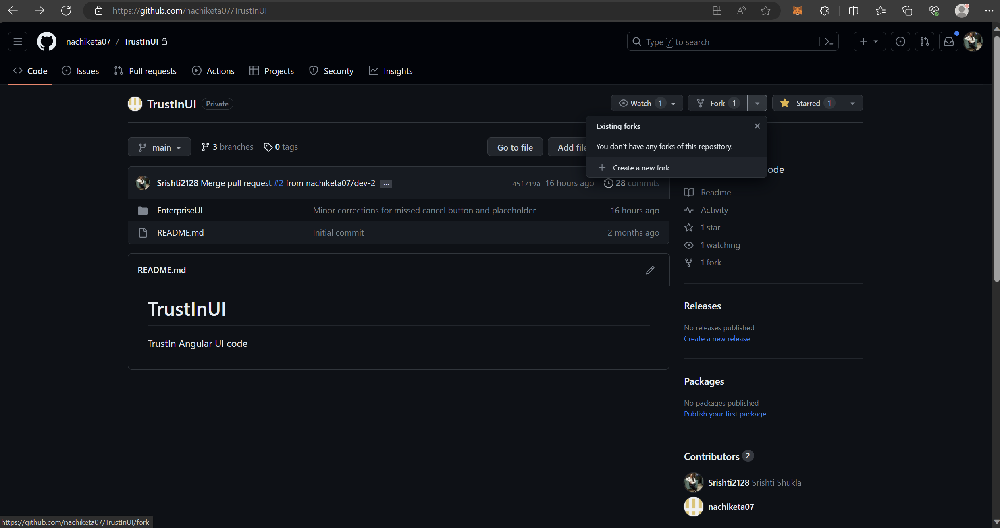
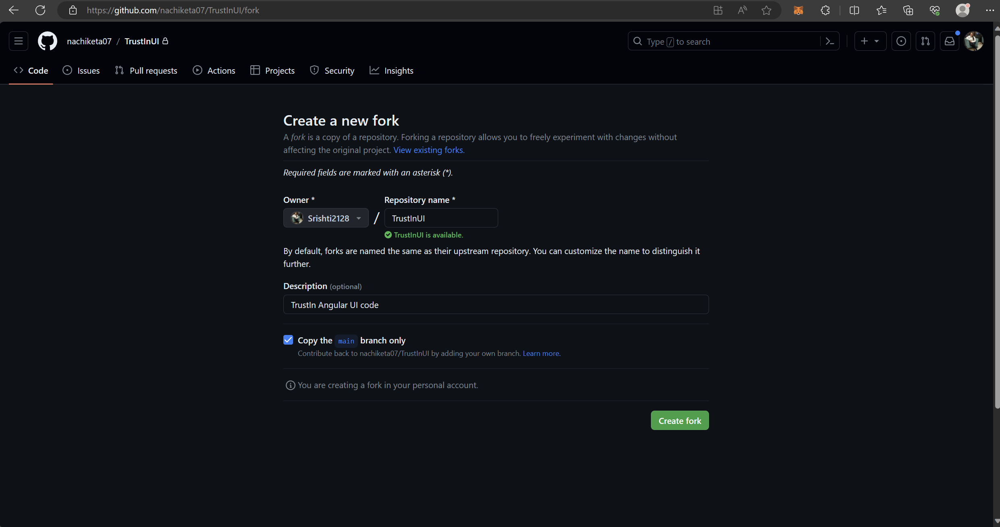
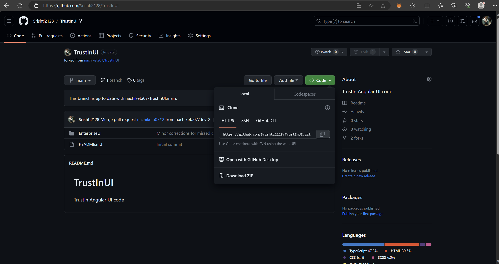
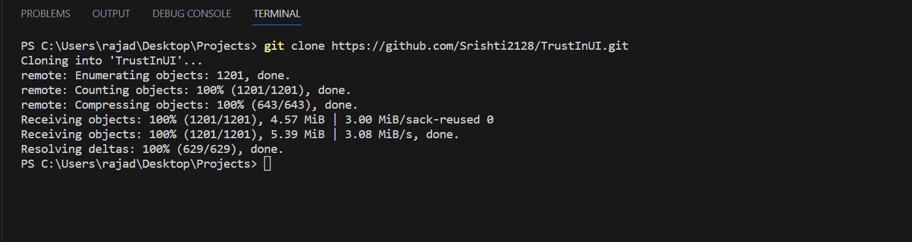
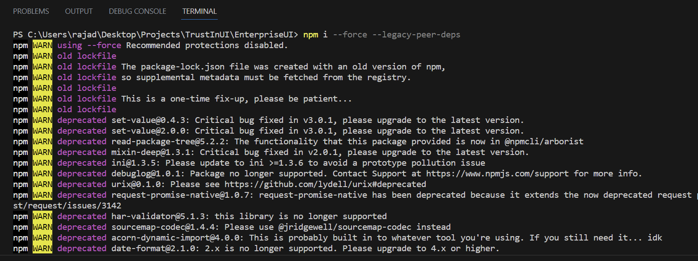
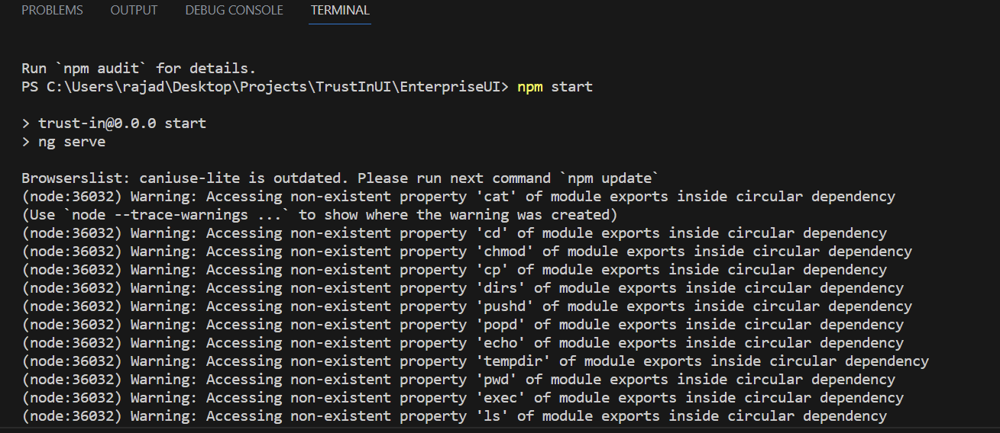

### 1. Fork it :fork_and_knife:

Head over to [TrustIn Github Repository](https://github.com/nachiketa07/TrustInUI) and fork the repository to your Github account

 

 

### 2. Clone it :busts_in_silhouette:

Clone the forked repository to your local machine

 

 

### 3. Set it up :arrow_up:

Head over to the TrustInUI/EnterpriseUI folder and run npm i --force --legacy-peer-deps

 

### 4. Run it :checkered_flag:

Once the installation is complete, run npm start

 

### 5. Start Developement 💥 

Translate Service has already been integrated and i18n files are generated. For any new content on the portal, create a name value pair in the below format : 

	"annualreport.natureofactionbyemp": "Nature of action taken by the employer"

After creating the name value pair, replace the content with translate pipe and the name value attribute as shown below:

    <label class="mgt10" for="reportDate">{{'annualreport.natureofactionbyemp' | translate}} </label>

You can notice the change in language on the webpage as soon as you select the language using the language switcher in login page.
