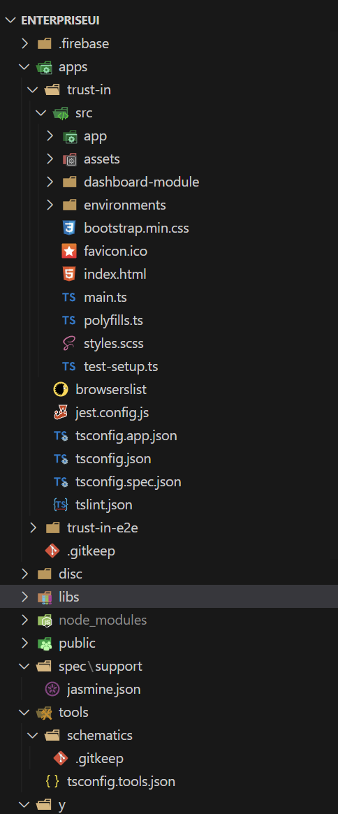

## Milestones
- Setting up the TrustIn project:
During this period I cloned the TrustIn UI repository on my local machine and installed all the packages required for the project.

- Exploring the portal:
In order to make the entire website multilingual, I requested for login credentials from my mentor to access the portal. I explored the portal by loggin in from different credentials, each one for a seperate user role - admin, IC Member, Employee. I realized the portal will look different to different people based on their roles and thus it will be important that if change be made in any one place, it should be reflected to other user roles as well.

- Understanding the Codebase:
Post cloning and installing the TrustIn UI repository, I started to understand the project structure, impact of each file change on the live portal and how the system is working behind the scenes. The ultimate goal is to make the entire website available in multiple languages so that employees from diverse backgrounds can also utilize the portal and raise complaints against bullying, harassment and this will help in building a safe workplace.

## Learnings

### - Project Architecture/Design

For the TrustIn project, the chosen architectural approach is based on the Model-View-Controller (MVC) pattern. The MVC pattern is a widely used architectural design pattern that provides a structured and organized way to develop web applications. It separates the application into three interconnected components, each with its own distinct role:

**Model:**
The Model represents the data and business logic of the application. It encapsulates the data structures, database interactions, and any computations or rules that govern the application's behavior.
In the TrustIn project, the Model handles data management, including retrieving case records, user information, and other relevant data from databases or external APIs.

**View:**
The View represents the user interface (UI) of the application. It is responsible for displaying data to users and capturing their interactions.
In the TrustIn project, the View encompasses the various components and templates that users interact with, such as the dashboard, case record views, and other UI elements.

**Controller:**
The Controller acts as an intermediary between the Model and the View. It receives user input from the View, processes it, and updates the Model accordingly.
In the TrustIn project, the Controller manages the application's flow, handling user interactions, and updating the Model with relevant data. It ensures that the data presented to users in the View is always in sync with the underlying data in the Model.

#### Advantages of the MVC architectural pattern in the TrustIn project:

**Separation of Concerns:** The MVC pattern separates the application into distinct components, making it easier to manage and maintain each aspect independently. This separation promotes code modularity and reusability.

**Code Organization:** By following the MVC pattern, the TrustIn project can maintain a clear and organized codebase. Each component has a specific role, allowing developers to find and modify code more efficiently.

**Scalability:** The architecture facilitates scalability as the application grows. New features or changes can be introduced without significantly affecting other parts of the application, making it easier to extend and adapt the TrustIn project over time.

**Testability:** The separation of concerns in the MVC pattern makes it easier to write unit tests for individual components. Testing the Model, View, and Controller independently ensures robustness and helps identify and fix bugs more effectively.

Overall, the Model-View-Controller architectural approach chosen for the TrustIn project provides a solid foundation for building a well-structured, maintainable, and scalable web application. By adhering to this pattern, the development team can ensure a smooth development process and a positive user experience for TrustIn portal users.

### - Project Structure

At a high level, the project structure of the TrustIn application consists of several key folders and files, each serving a specific purpose. Here is an overview of the main folders and key files:

- **src Folder (Root Directory):**
  The src folder is the root directory of the TrustIn project, containing all the main source code and assets for the application.

- **index.html:**
    This file serves as the entry point of the application and is responsible for loading the Angular app into the browser. It also includes necessary scripts and stylesheets.

- **main.ts:**
The main.ts file is the primary TypeScript file that bootstraps the Angular application by initiating the Angular platform.

- **app Folder:**
The app folder is the heart of the TrustIn application, containing various components, services, modules, and other files that make up the application's structure.

- **assets Folder:**
The assets folder stores static assets such as images, fonts, and other resources that are used in the application.

- **AppModule:**
The AppModule is the root module of the application. It serves as the entry point for the application and orchestrates the integration of other modules and components.

- **Dashboard Module:**
The Dashboard Module is a module that encapsulates all components, services, and resources related to the dashboard functionality in the TrustIn application.

- **Case-Record Module:**
The Case-Record Module focuses on managing and presenting case records within the TrustIn application. It encapsulates components and services related to case records.

- **Shared Module:**
The Shared Module contains reusable components, directives, and services used across different parts of the application. It promotes code reusability and simplifies maintenance.

- **Configuration Files:**
  * **package.json:** Lists the project's dependencies, scripts, and metadata, used by package managers like npm for dependency management.
  * **angular.json:** The main configuration file for the TrustIn project, defining settings such as build options, file paths, and asset configurations.
  * **tsconfig.json:** Specifies the TypeScript compiler options and paths for TypeScript files.
  * **tslint.json:** Configures TSLint, a static analysis tool for TypeScript, defining linting rules and settings for the project.

  Additionally, the TrustIn project is hosted on Firebase, a popular platform for hosting and deploying web applications. The Firebase platform offers various services, including hosting, real-time database, authentication, and more, making it suitable for the TrustIn application.

  * **firebase.json:**
The firebase.json file is the configuration file used for Firebase hosting. It defines settings related to hosting, such as the public directory and other deployment configurations.

By organizing the TrustIn project in this structured manner, I can efficiently manage the codebase, maintain modularity, and ensure a smooth development process.

## Screenshots / Videos 

- **Project Structure**

 

