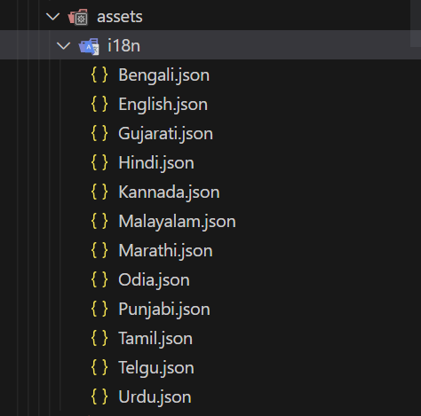
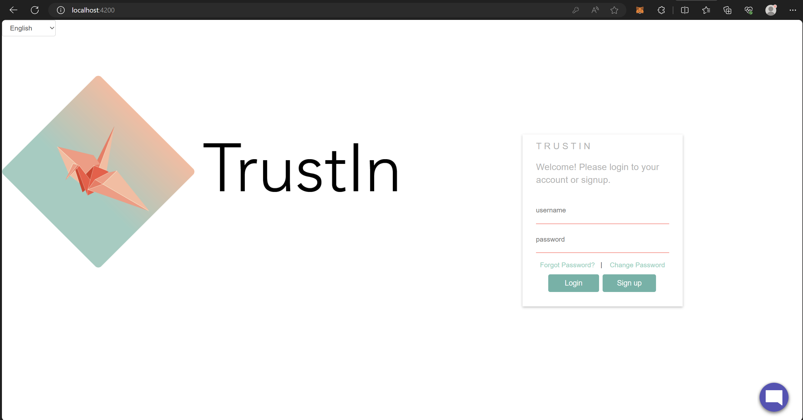
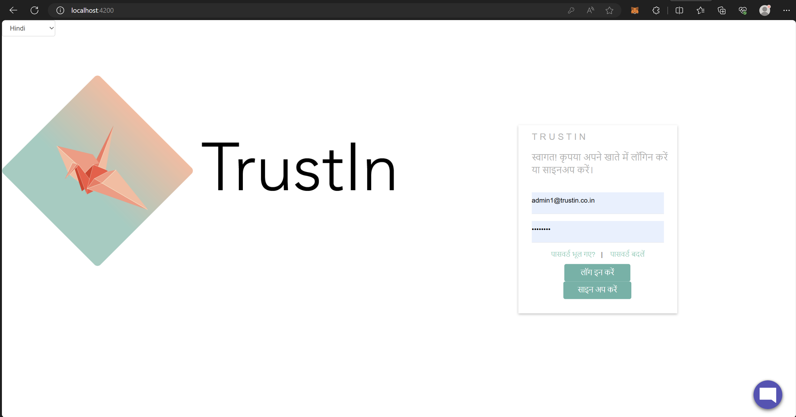

## Milestones
### - Had a discussion with my mentor for all the languages we need to support:
During the discussion with my mentor, we identified the need to support multiple languages to cater to a diverse user base. The languages to be supported have been determined based on user demographics and organizational requirements. The list of languages includes, but may not be limited to,
  * English
  * Hindi
  * Marathi
  * Malayali
  * Tamil
  * Telugu
  * Urdu
  * Gujarati
  * Odia
  * Kannada
  * Punjabi
  * Bengali

### - Research work for ways to implement multinguality:
After conducting thorough research on achieving multilingual support for our portal, I identified several effective methods to enhance user experience and implement multilingual support:

  * **Internationalization (i18n):** Leveraging Angular's i18n tools to mark translatable text and generate message files for translations.

  * **ngx-translate:** Exploring the 'ngx-translate' library for dynamic loading of translations and displaying content in users' preferred languages.

  * **Transloco:** Evaluating 'Transloco' library's features, including lazy-loading translations and scoped translations.

  * **Language Switcher Component:** Implementing a language switcher component for easy language selection.

  * **Locale Settings:** Handling locale-specific settings such as date and currency formats.

  * **Translation Management Tools:** Considering tools like Crowdin or Lokalise for efficient translation management and updates.

  * **Dynamic Content Loading:** Loading translations dynamically from external sources like a CMS for frequently changing content.

  * **Localized URLs:** Implementing localized URLs to target users in specific regions with language-specific content versions.

  * **HTML lang Attribute:** Utilizing the 'lang' attribute in the HTML tag to set the default language.

  * **Language-Specific Assets:** Organizing assets to load based on the selected language for a seamless user experience.

  * **Language Detection:** Exploring language detection mechanisms based on user location or browser settings.

### - Choosing the most efficient method:
For the implementation of multilingual support in the TrustIn project, after a discussion with my mentor, we chose to adopt a combination of Internationalization (i18n) using ngx-translate along with the integration of a Language Switcher Component.

  * **Internationalization (i18n)** provides a powerful foundation for handling translations within our Angular application. By leveraging Angular's built-in i18n tools, we can effectively mark translatable text and generate corresponding message files. The ngx-translate library will seamlessly complement this approach, offering dynamic loading of translations and enabling the display of content in users' preferred languages.

  * To provide a seamless user experience and easy language selection, we will develop a **custom Language Switcher Component**. This component will allow users to effortlessly choose their preferred language, ensuring that the content they interact with aligns with their language preferences.

By adopting these chosen methods, my aim is to create a globally inclusive and user-friendly environment within TrustIn, where users can access the platform in their preferred language and fully engage with our services.

### - Test Run:
I implemented the above selected method to convert the login page to different languages. I created key value pairs inside the various language.json files and replaced the html contents in textual format to the keys used inside the language files. This worked seamlessly and I could see the login page changing its languages on selection.

## Screenshots / Videos 

- **Adding Languages**

 

- **Login Page**

 

 

## Learnings

### Based on the completed milestones, here are the key takeaways:

* **Multilingual Implementation:** Through research and practical testing, I learned how to implement multilingual support using methods like Internationalization (i18n) and ngx-translate. These approaches allowed me to mark translatable text, generate message files, and dynamically load translations to display content in users' preferred languages.

* **Choosing the Best Method:** I gained insights into which method is best suited for specific use cases. For example, combining Internationalization (i18n) with ngx-translate and implementing a Language Switcher Component provided an efficient solution for offering seamless language selection to users.

* **Caution in Direct Translation:** I became aware of the potential challenges in directly translating content from one language to another. Some phrases or terms may not have an exact equivalent in another language, leading to a loss in understanding for users. To address this, I learned the importance of identifying such critical places and implementing transliteration, where necessary, to maintain clarity and comprehension.

By understanding the intricacies of multilingual implementation and being cautious in handling translations, I have acquired the knowledge needed to create a user-friendly and inclusive multilingual environment within the TrustIn project.