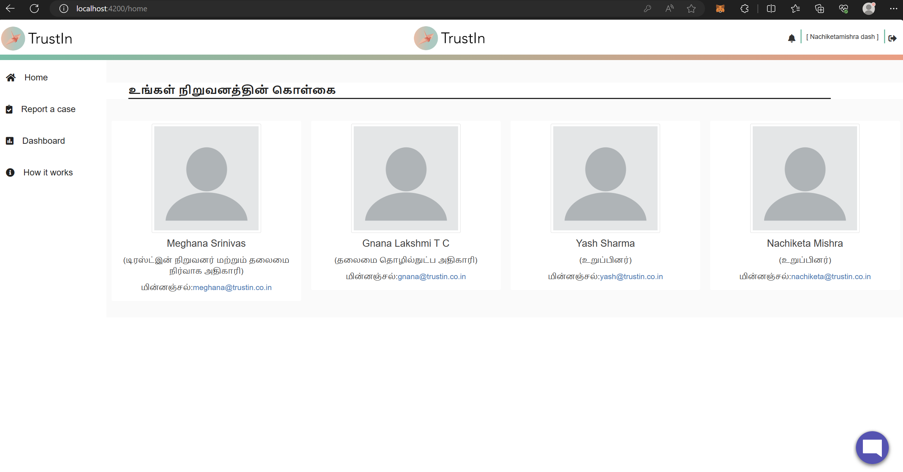
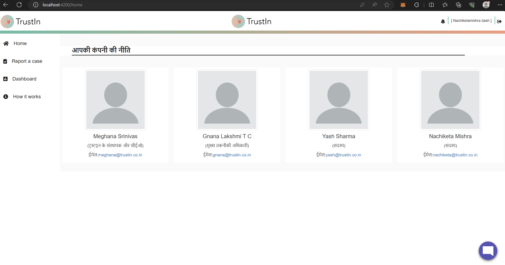
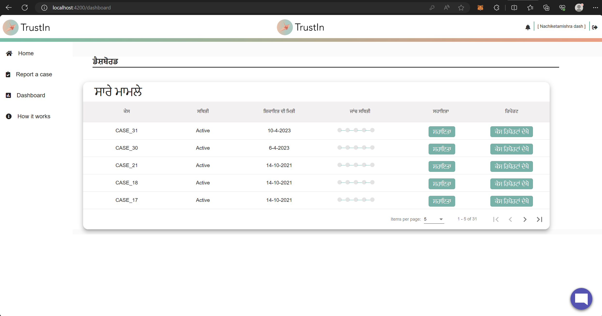
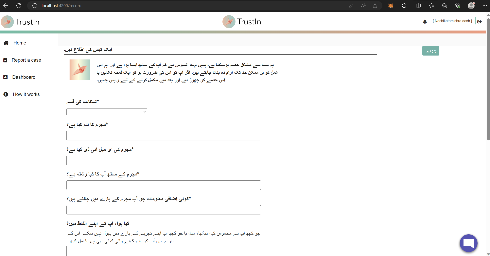
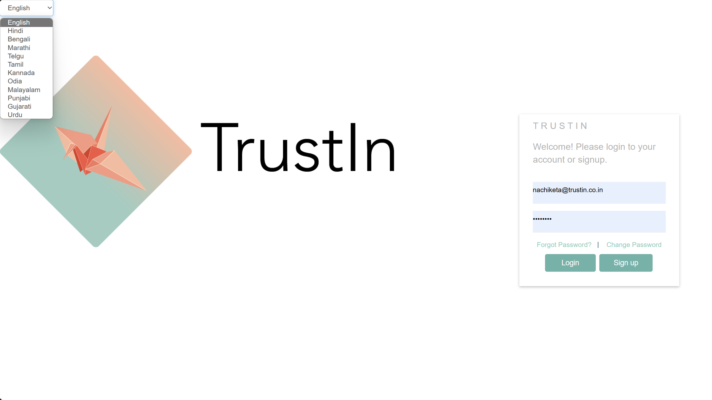
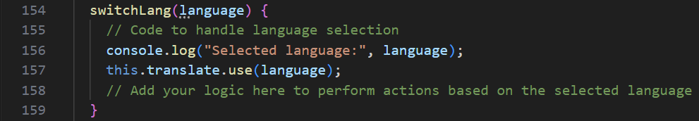
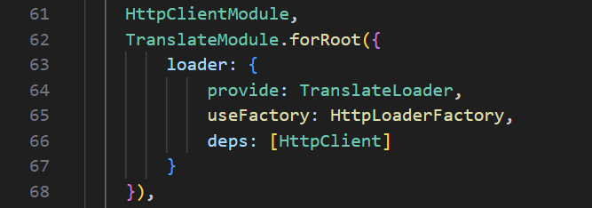
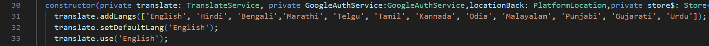

## Milestones
- **Language Support for Home Page:** Successfully added language support for the Home (Main) Page in all the required languages. Users can now view content in their preferred language, enhancing their overall experience on the platform. (Navigation Bar support is pending and will be taken up in the upcoming phase.)
- **Multilingual Dashboard:** The Dashboard is now multilingual, ensuring that users receive relevant information in the language of their choice. This enhancement improves user engagement and comprehension, making the platform more inclusive.
- **Multilingual Case Reporting using Textbox:** Users can now report cases in their preferred language using the textbox method. This functionality facilitates effective communication and interaction, bridging language barriers and promoting ease of use. (Form Method multilingual support is pending and will be taken up in the upcoming phase.)
- **Functioning Language Switcher:** Successfully implemented a functioning Language Switcher, enabling users to select their preferred language easily. The Language Switcher provides a seamless language selection experience, enhancing user satisfaction. Further, focusing on UI/UX design for the Language Switcher is to be taken up.
- **Global Language Switching:** The Language Switcher now works globally across the application. Once a user selects their preferred language, it will be maintained consistently throughout all pages until further changes are made. This feature eliminates the need for users to select their language on every page, creating a smoother and more cohesive experience.

## Screenshots / Videos 

- **Home Page in Tamil (Navbar pending)**

 

- **Home Page in Hindi (Navbar pending)**

- **Dashboard in Punjabi (Navbar pending)**

- **Case Reporting (TextBox Method) in Urdu**

- **Language Switcher Component**

 

  

 - **Code to maintain one language across all pages**

 

 

## Contributions

- [Pull Request for the changes](https://github.com/nachiketa07/TrustInUI/pull/1)

## Learnings

- **ngx-translate Integration:** Acquired knowledge on integrating the ngx-translate library to dynamically load translations, making content available in users' preferred languages. Successfully implemented the Language Switcher, allowing users to switch languages seamlessly.

- **Global Language Switching:** When translate service is implemented component wise, it stores language defaults individually for each component. But since, we want our entire appliction in same language post login, I used the app.component [the mother component] for it and once the setup is done in the app component, I used the translate pipe in all other components to translate the text. However, there were several modules in the application like - Dashboard Module, Case Record Module and the App Module (ofcourse !), so I had to import the translate service into all of these modules but allow a single point of operation from app component.