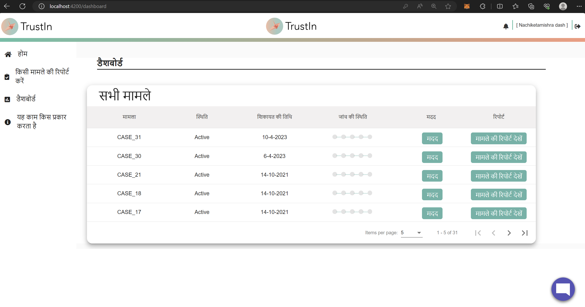
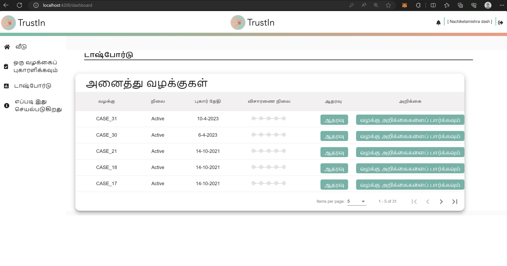
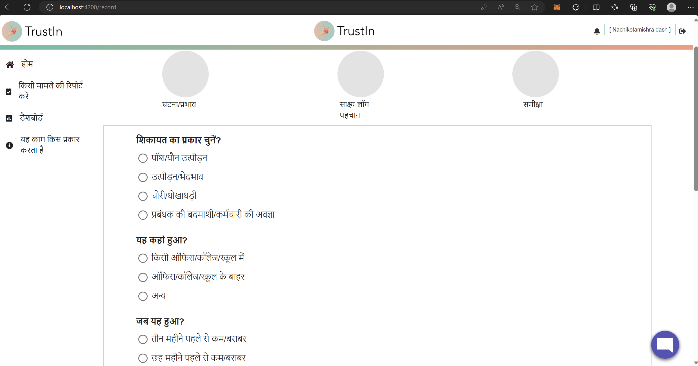
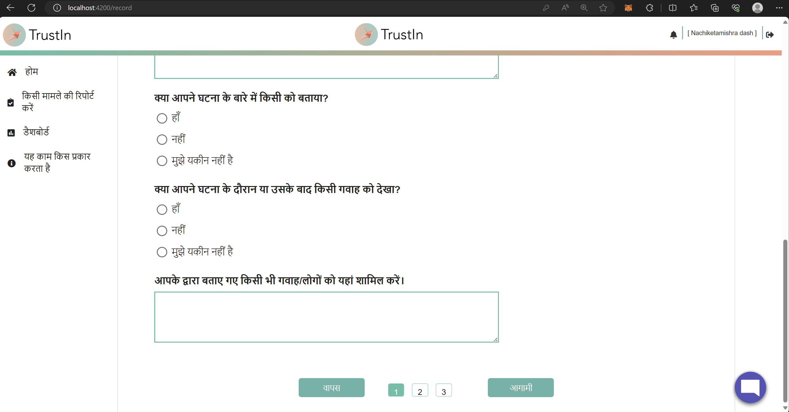
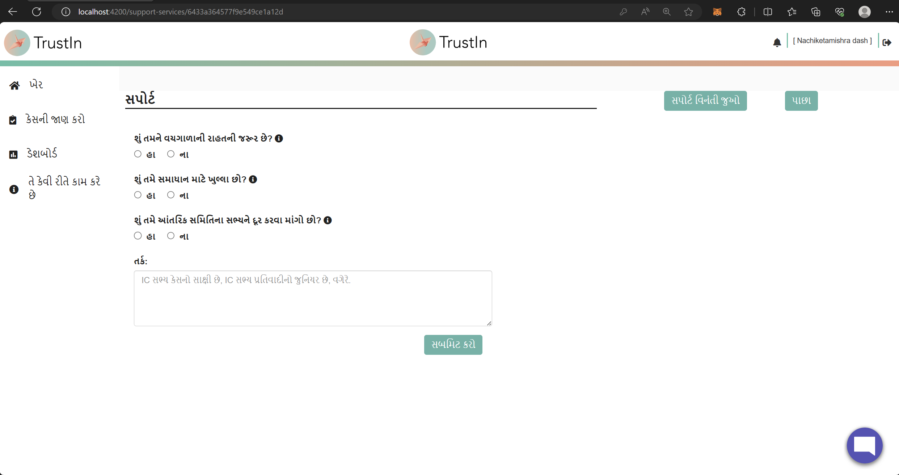
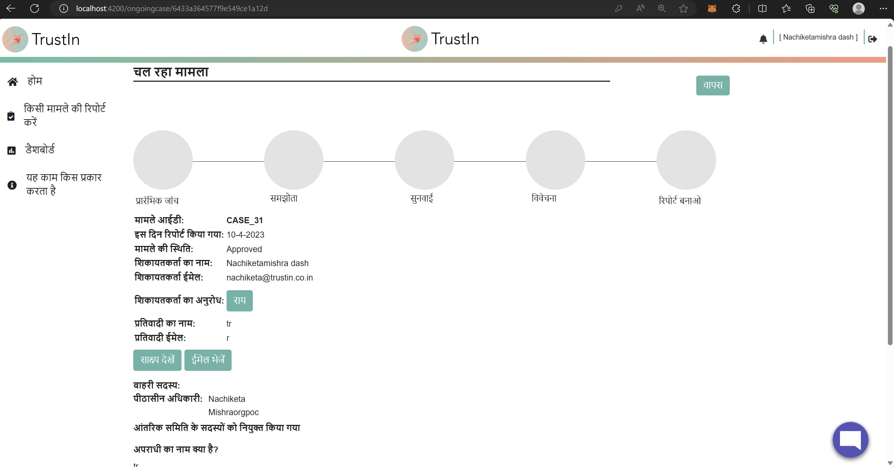
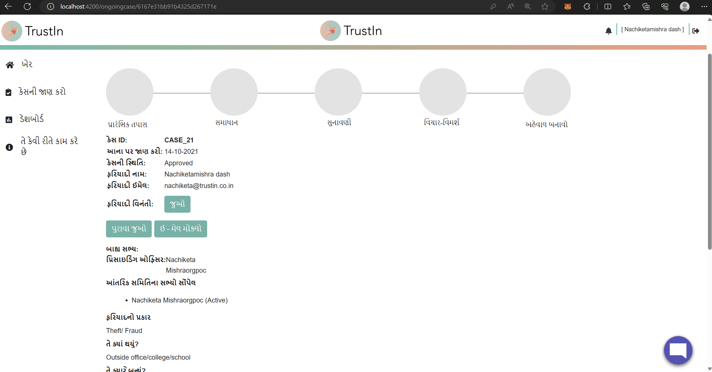

## Milestones
- **Language Support for Navigation Bar:** Successfully added language support for the Navigation Bar, ensuring users can access essential features in their preferred language. Transliteration was applied as per mentor instructions, enhancing user comprehension.
- **Multilingual Case Reporting using Form Method:** Extended multilingual support to the case reporting process by implementing it to the form method (earlier only textbox method had multilingual support). Users can now report cases seamlessly in their preferred language using both methods on the portal, facilitating effective communication.
- **Improved Language Switcher Design:** Made significant improvements to the Language Switcher's appearance, enhancing its aesthetics and usability. Further optimization for UI/UX will be undertaken in the upcoming phases to offer an even better user experience.
- **Multilingual Support for Help/Support Page and Case Report Page:** Expanded multilingual coverage to the Help/Support Page and Case Report, ensuring comprehensive language support for users navigating through these crucial sections of the platform.
- **Global Language Switching:** The Language Switcher now works globally across the application. Once a user selects their preferred language, it will be maintained consistently throughout all pages until further changes are made. This feature eliminates the need for users to select their language on every page, creating a smoother and more cohesive experience.

With all the above implementations, the portal is now fully multilingual for regular employees. They can access all platform functionalities and content in their preferred languages, fostering inclusivity and user satisfaction.

## Looking Ahead
- **Multilingual Support for Admin:** In the coming week, focus will be on extending multilingual capabilities to the Admin section, ensuring that administrators can interact with the platform in their preferred language.
- **Testing and Refinement:** Over the next three weeks, thorough testing of translations will be conducted to ensure their accuracy and coherence across all supported languages. This critical phase aims to deliver a seamless user experience for individuals using the platform in any language.

## Screenshots / Videos 

- **Navbar in Hindi**

 

- **Navbar in Tamil**

- **Case Reporting (Form Method) in Hindi**

- **Case Reporting (Form Method) in Bengali**

- **Language Switcher Component**

 

- **Support Page in Hindi**

 

- **Support Page in Gujarati**

 

- **Case Report (details) in Hindi**

 

 - **Case Report (details) in Gujarati**

 

## Contributions

- [Pull Request for the changes](https://github.com/nachiketa07/TrustInUI/pull/1)

## Learnings

- **Translating strings referenced using variables in components where the strings are not explicitly declared (declared somewhere else):** Translating text present inside innerHtml directly was simpler than translating text which was passed as an attribute, props etc. to/from the components and then loaded up. For this, I had to create key value pairs in the lang.json files with the key = string to be translated (for simple text inside html, I could use any name to refer them, but for variables which carried some value in them I had to store them in my key-name) and the value eqaul to the translated string corresponding to the key depending on the lang file we are in.

- **Multilingual Complexity:** Understood the complexities of multilingual support, including handling varying text lengths, font styles, and character encodings across different languages.