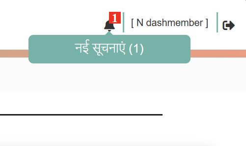
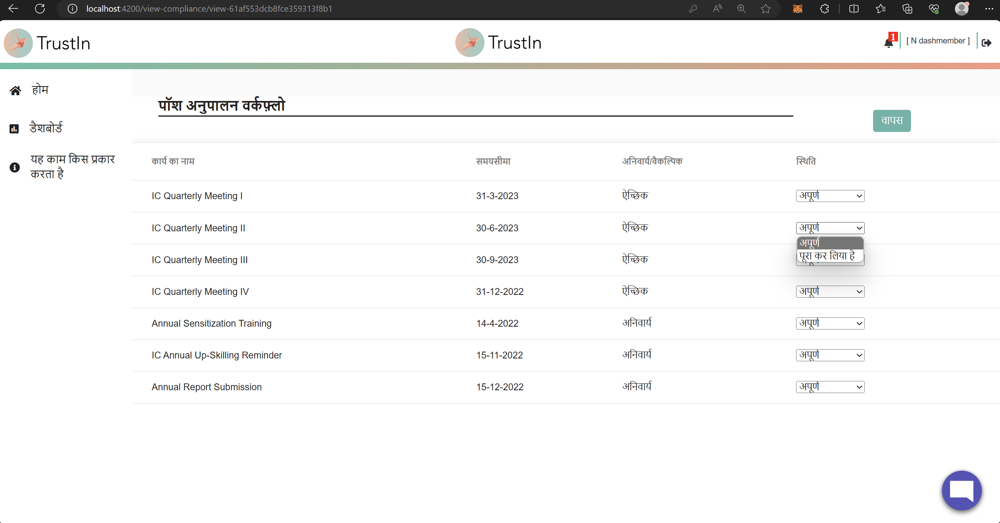

## Milestones
- **Role-Specific Component Exploration:** Conducted an in-depth exploration of the platform from the perspective of an IC Member role. This analysis included identifying components that are exclusive to IC Members and components that are restricted solely for employees. This understanding is crucial for ensuring a seamless and role-specific multilingual experience.
- **Multilingual POSH Compliance Workflow Page:** Successfully implemented multilingual support for the POSH Compliance workflow page. All dropdowns, including dynamically populated options(but known in nature from UI), have been accurately translated, ensuring that IC Members can navigate through the compliance process effortlessly in their preferred language.
- **Multilingual Notifications in Header Bar:** Extended multilingual support to the notifications in the header bar. Users can now receive notifications in their chosen language, enhancing their understanding and interaction with the platform.

With all the above implementations, the portal is now partially multilingual for IC members. They can access the POSH Compliance Workflow and Notifications in any of the 12 languages they desire

## Screenshots / Videos 

- **Notifications in Hindi**

 

- **POSH Compliance Workflow Page in Hindi**

## Contributions

- [Pull Request for the changes](https://github.com/nachiketa07/TrustInUI/pull/1)

## Learnings

- **Quality Assurance through Thorough Testing:**  The process of comprehensive testing highlighted the critical role it plays in ensuring the accuracy and consistency of translations. It's an indispensable step to maintain a high standard of user experience, particularly when implementing multilingual features.

- **Holistic Multilingual Implementation:** The successful integration of multilingual support in various sections, such as the Generate Report page and Annual Report Generation, underscores the importance of providing a consistent and inclusive user experience throughout the platform.
