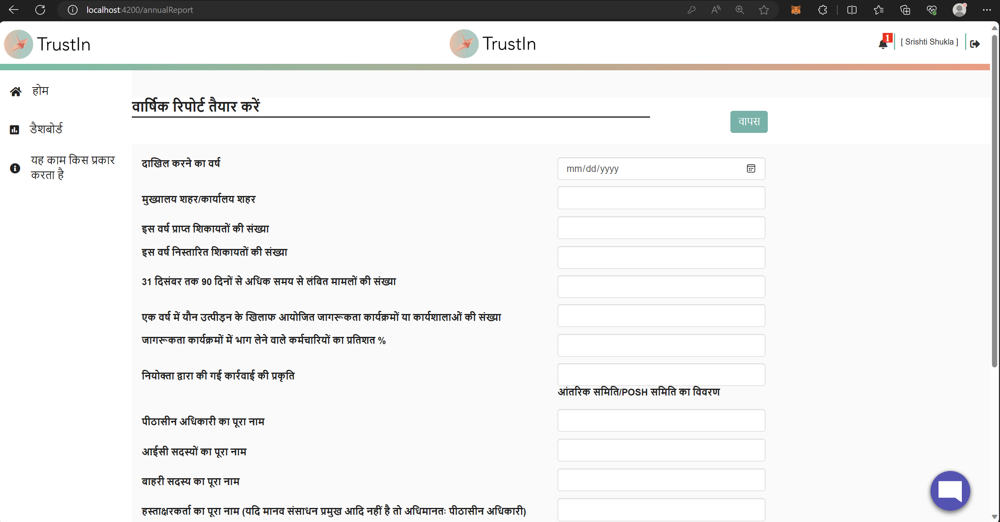
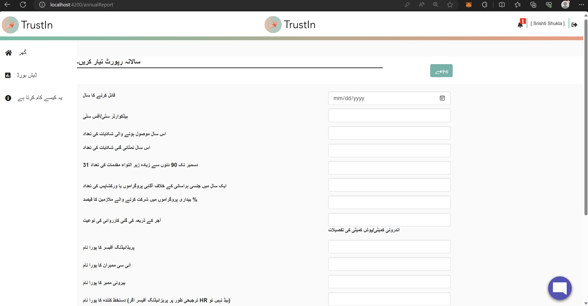
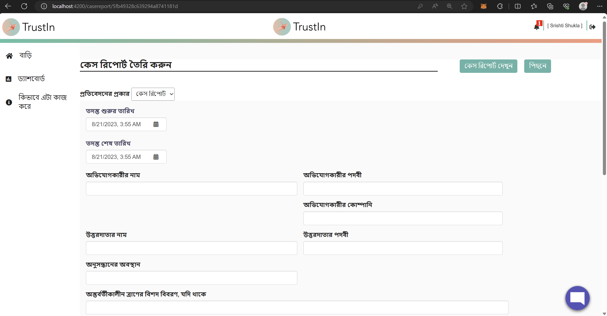
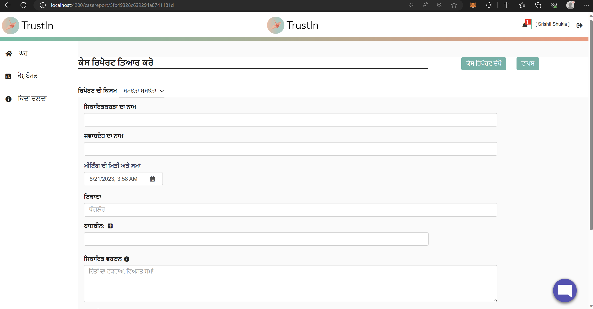
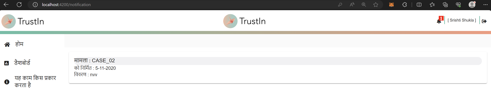

## Milestones
- **Thorough Testing of Translations:** I initiated a comprehensive testing phase encompassing all translations completed up until week 3. During this meticulous review, I identified a previously missed component - the detailed notifications page - and promptly converted it to ensure consistent multilingual coverage.
- **Multilingual Generate Report Page:** Successfully introduced multilingual support for the Generate Report page. Both types of reports, Case Report, and Settlement Agreement, now offer translations for dropdowns, placeholders, and content, enhancing accessibility and comprehension.
- **Multilingual Annual Report Generation:** Extended multilingual capabilities to the Annual Report Generation page. Users can now generate annual reports in their preferred language, further promoting inclusivity and engagement.

## Screenshots / Videos 

- **Annual Report Generation in Hindi**

 

- **Annual Report Generation in Urdu**

- **Report Generate in Bengali (Case Report)**

- **Report Generate in Punjabi (Settlement Agreement)**

- **Detail Notifications Page in Hindi**

## Contributions

- [Pull Request for the changes](https://github.com/nachiketa07/TrustInUI/pull/1)

## Learnings

- **Quality Assurance through Thorough Testing:**  The process of comprehensive testing highlighted the critical role it plays in ensuring the accuracy and consistency of translations. It's an indispensable step to maintain a high standard of user experience, particularly when implementing multilingual features.

- **Holistic Multilingual Implementation:** The successful integration of multilingual support in various sections, such as the Generate Report page and Annual Report Generation, underscores the importance of providing a consistent and inclusive user experience throughout the platform.

