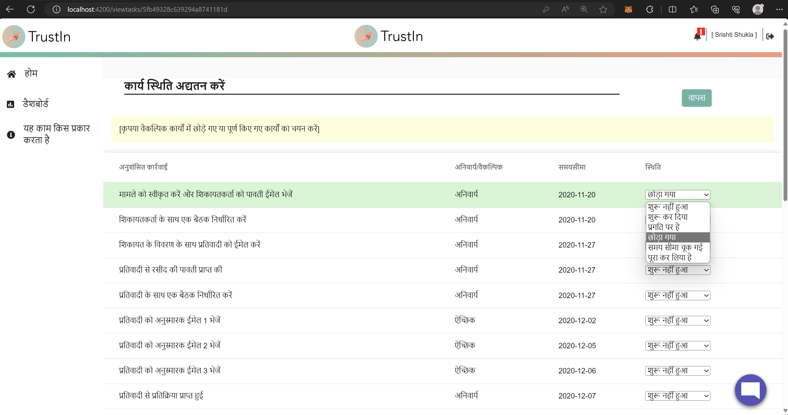
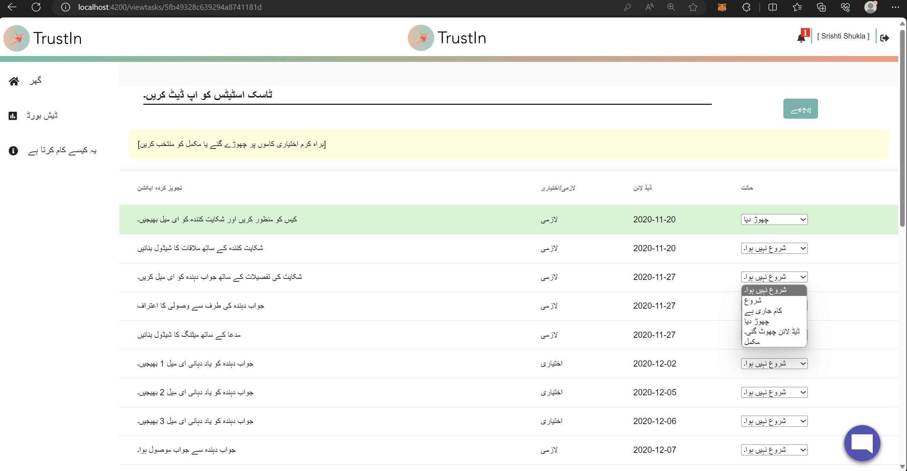
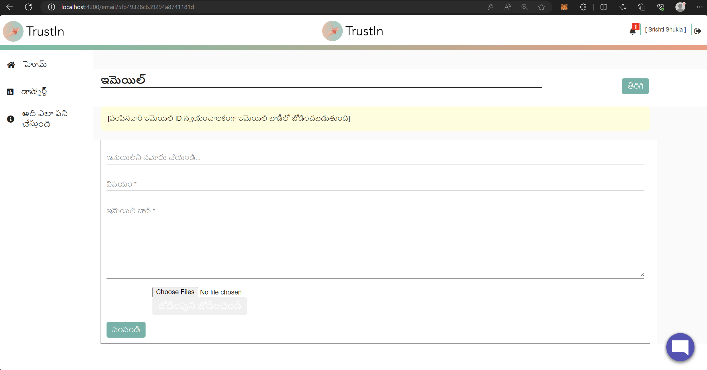
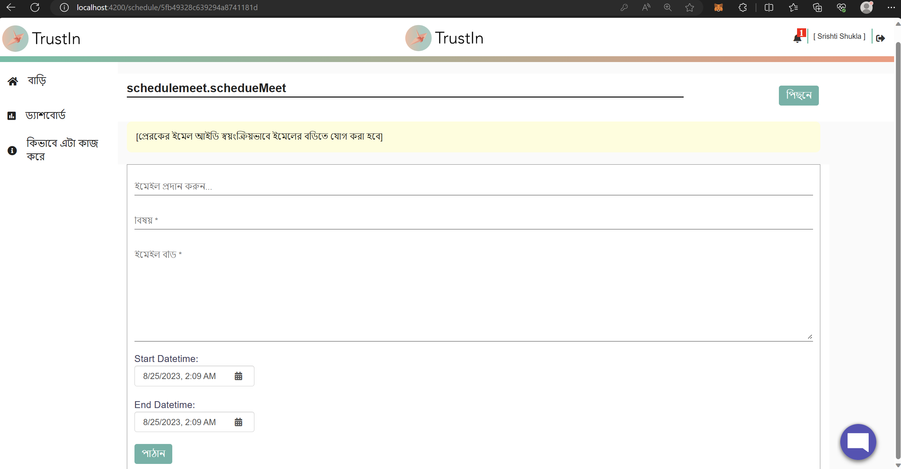
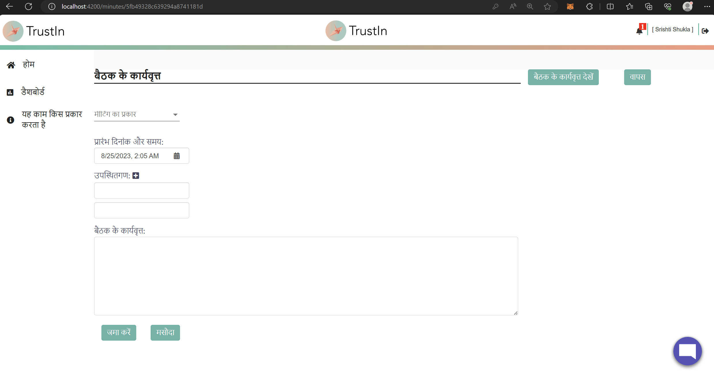
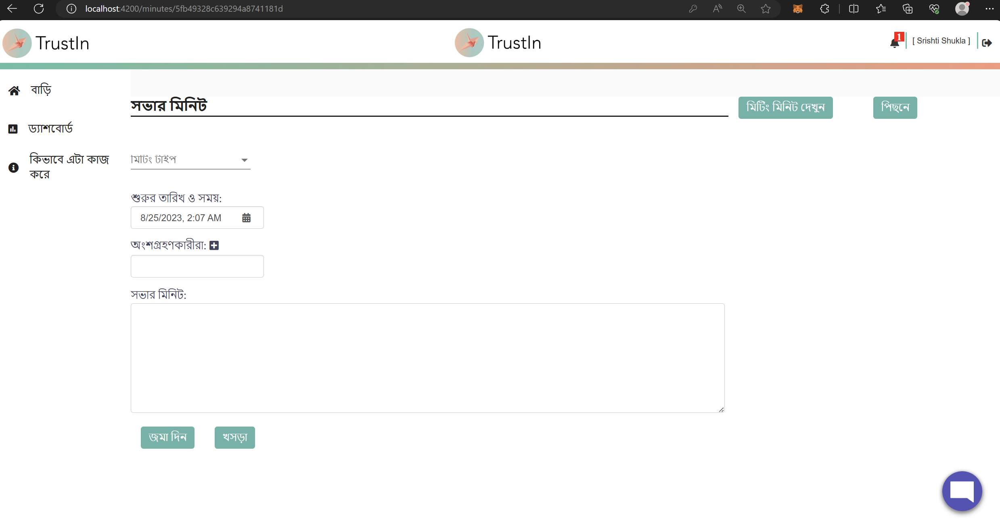
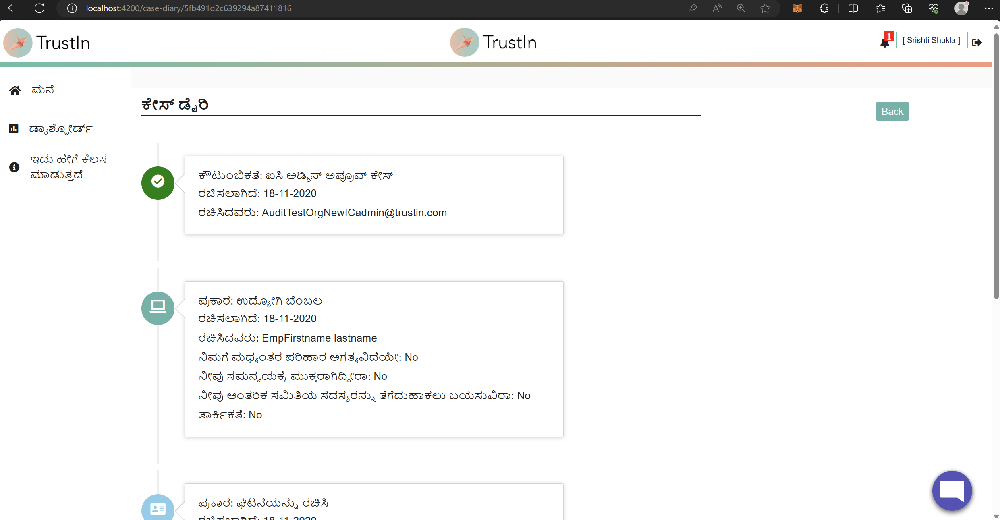

## Milestones
- **Language Support for Update Task Page:** Successfully incorporated language support for the Update Task page. All static backend data, including recommended actions, mandatory/optional columns, and status dropdowns, have been meticulously translated in the UI. This ensures users can navigate and understand these elements in their preferred language.
- **Multilingual Sending Email Page:** Extended multilingual capabilities to the Sending Email page, empowering users to communicate effectively in their chosen language. This enhancement bolsters user engagement and streamlines communication.
- **Multilingual Support for Schedule Meet Page:** Multilingual support has been seamlessly integrated into the Schedule Meet page. This includes translating all placeholders, ensuring users can effectively schedule meetings in their preferred language without any obstacles.
- **Multilingual Minutes of Meeting Page:** The Minutes of Meeting page now offers multilingual support for both adding new meeting minutes and viewing previously added ones. This comprehensive implementation fosters transparency and understanding.
- **Multilingual Case Diary Page:** Further extending multilingual reach, the Case Diary page displays case logs in multiple languages. This ensures that users can comprehend and engage with case-related information regardless of their language preference.

## Screenshots / Videos 

- **Update Task Page in Hindi**

 

- **Update Task Page in Urdu**

- **Send Mail Page in Bengali**

- **Send Mail Page in Tamil**

- **Schedule Meet Page in Bengali**

- **Minutes of Meeting Page in Hindi**

- **Minutes of Meeting Page in Bengali**

- **Case Diary Page in Kannada**

## Contributions

- [Pull Request for the changes](https://github.com/nachiketa07/TrustInUI/pull/1)

## Learnings

- **Efficient Placeholder Handling:** The implementation of multilingual support on the Minutes of Meeting page, including adding and viewing minutes, demonstrates efficient handling of placeholders. This learning reflects the ability to dynamically replace placeholders with translated content.

- **Internationalization Tools Mastery:** Successfully integrating multilingual capabilities underscores a solid understanding of internationalization tools. This includes leveraging Angular's features effectively for marking translatable content and generating message files.

