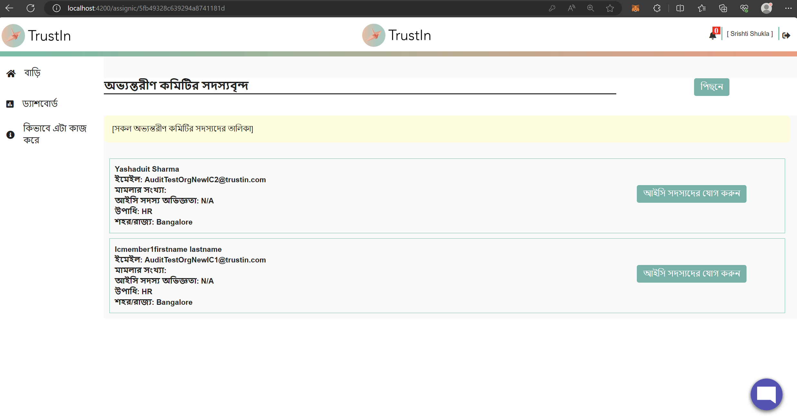
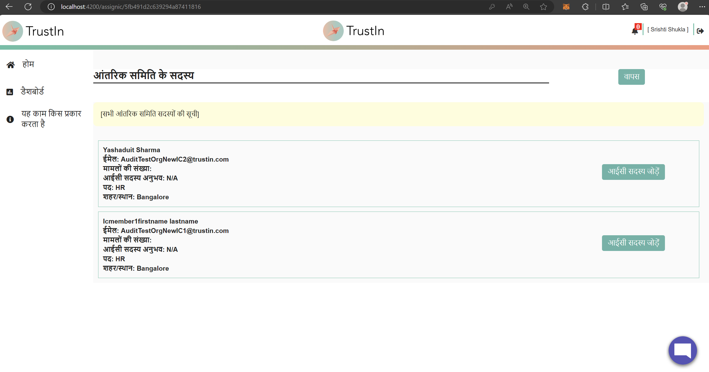
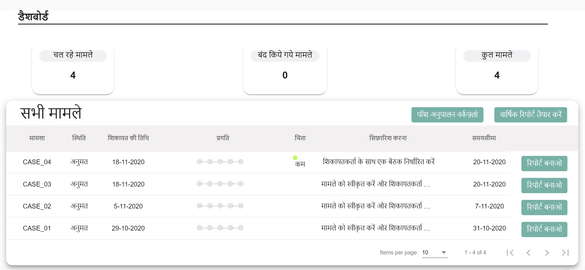
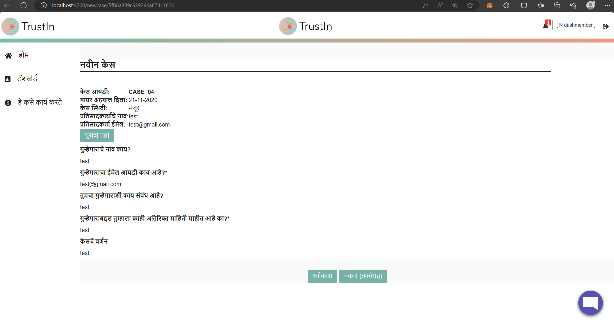

## Milestones
- **Language Support for Assign IC Page:** Successfully added language support for the Assign IC Page. This milestone ensures that Presiding Officers can navigate and comprehend this critical aspect and add any available IC members of the platform to a particular case in their preferred language.
- **Enhanced Multilingual Support for Case in Progress Page:** Multilingual support for the Case in Progress Page has been expanded and optimized. This step includes meticulous translation to rectify any missed translations from earlier stages, contributing to a seamless user experience.
- **Predictive Multilingual Data Handling:** Extended multilingual capabilities to predictive data from the backend, such as choices, options via radio buttons, checkboxes, and dropdowns. This enhancement guarantees users receive accurate and meaningful translations for all interactive elements.
- **Login Page Placeholder Corrections:** Placeholder translations on the Login Page have been diligently rectified. This addresses any complexities that may have caused initial omissions, ensuring that users encounter consistent and accurate language throughout their experience.
- **Unified Translations across Dashboards:** Synchronized translations across all dashboards to ensure consistency in language usage. This optimization ensures that identical text is translated uniformly across all user profiles, fostering a cohesive and user-friendly environment.
- **New Case Accept/Reject Page Multilingual Support:** Successfully added multilingual support to the new case accept/reject page. This milestone ensures that IC Members can navigate, comprehend, and respond to case acceptance or rejection prompts in their preferred language.

## Screenshots / Videos 

- **Add IC Member Page in Bangla**

 

- **Add IC Member Page in Hindi**

- **Predictable Grid Data from Backend Multilingual**

- **New Case Alert Page in Marathi**

## Contributions

- [Pull Request for the changes](https://github.com/nachiketa07/TrustInUI/pull/1)

## Learnings

- **Continuous Improvement of Earlier Translations:** The enhanced multilingual support for the Case in Progress Page, including addressing missed translations, underscores the value of continuous improvement. This learning showcases that the multilingual process is an ongoing effort that requires thorough attention and adaptation.

- **Accuracy in Predictive Data Translation:** The successful multilingual implementation for backend predictive data like choices, options, and interactive elements demonstrates the importance of accurate translations. This learning emphasizes the need for meticulous translation to ensure meaningful user interactions.

- **Attention to Details:** The correction of Login Page placeholder translations highlights the importance of attention to detail. This learning showcases that even minor omissions can impact user understanding, underlining the need for thoroughness in the translation process.

