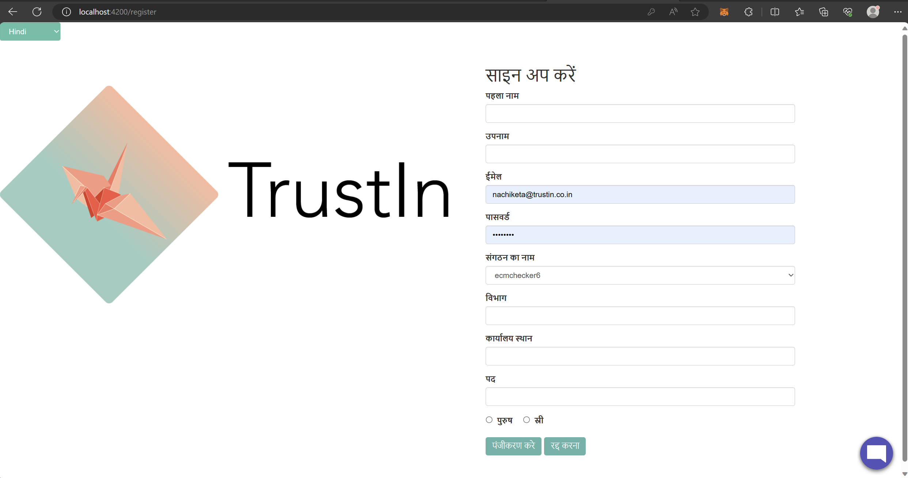
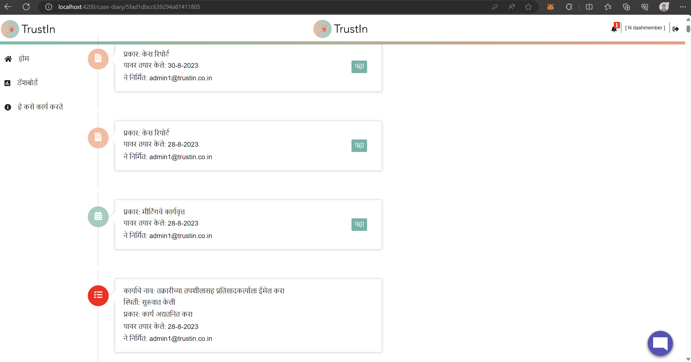
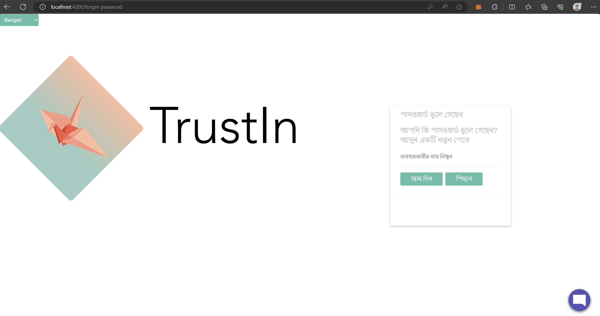
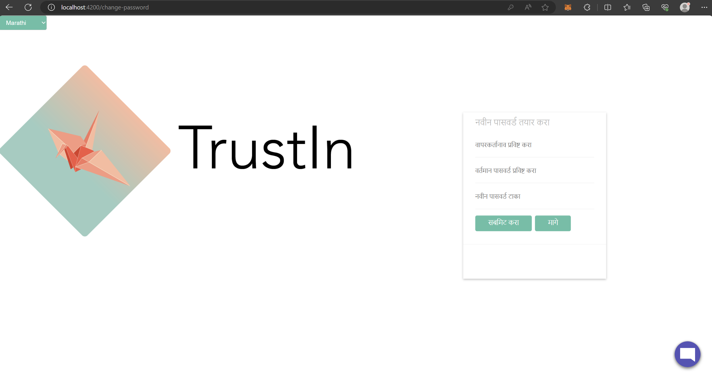
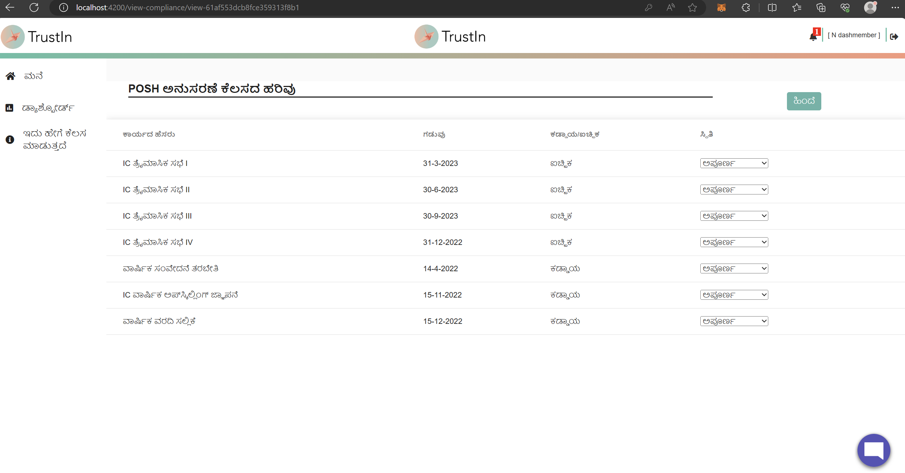
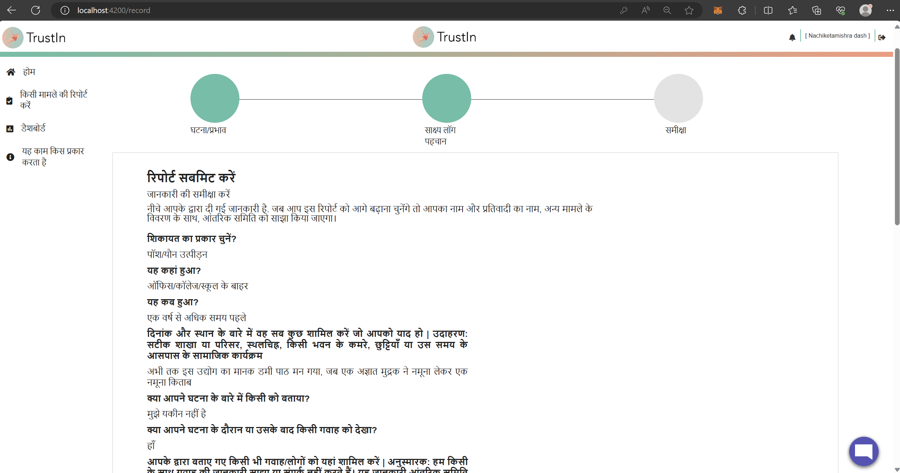
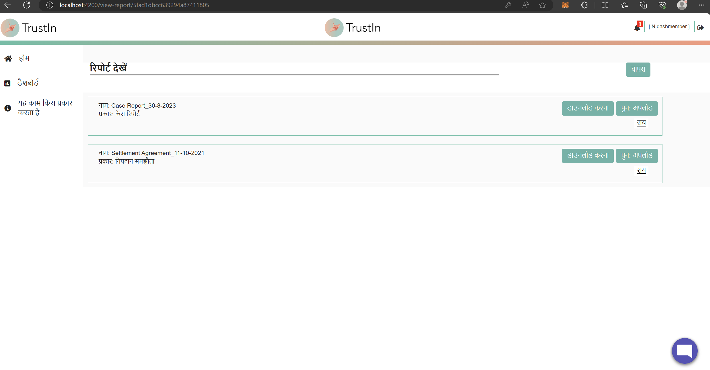

## Milestones
- **Language Support for Register Users/Signup Page:** Users can now register and sign up in their preferred language, fostering a user-friendly onboarding process.
- **Enhanced Multilingual Support for Case Diary:** Critical elements like Task Name and Task Status, originating from the backend and predictable on the UI, have been made multilingual within the Case Diary. This ensures accurate comprehension and engagement even for backend data.
- **Language Support for Forgot Password and Change Password Page:** Password management is now more accessible with language support for both the Forgot Password and Change Password pages.
- **Multilingual View Report Page:** Users can seamlessly navigate the View Report Page with translations for download and reupload buttons, enhancing their interaction with report-related content.
- **Multilingual Review Case Before Submitting Page:** The Review Case page before submission now offers multilingual support, ensuring that users can review and confirm case details in their preferred language.
- **Multilingual Posh Compliance Page:** All column data on the Posh Compliance Page have been made multilingual, streamlining access to compliance-related information for IC Members and keep a track of their due dates.
- **Refining Translations per Mentor Feedback:** Worked on updates provided by our mentor, which included editing translations at certain points to make them more meaningful. This iterative process is crucial for ensuring the highest quality of language support and user comprehension.

## Screenshots / Videos 

- **Register Users/Signup Page in Hindi**

 

- **Register Users/Signup Page in Marathi**

- **Case Diary page in Marathi**

- **Forgot Password Page in Bengali**

- **Change Password Page in Marathi**

- **POSH Compliance Page in Kannada**

- **Review Case pre-submitting in Hindi**

- **View Case Report Page in Hindi**

## Contributions

- [Pull Request for the changes](https://github.com/nachiketa07/TrustInUI/pull/1)

## Learnings

- **Accessibility in Password Management:** The introduction of language support for the Forgot Password and Change Password pages reflects the importance of accessibility in password management. This learning emphasizes that users should be able to reset and modify their passwords in their chosen language, improving usability.

- **Iterative Development:** The process of refining translations per mentor feedback emphasized the iterative nature of multilingual development. It highlighted the importance of continuous improvement and attention to detail in translation work.
