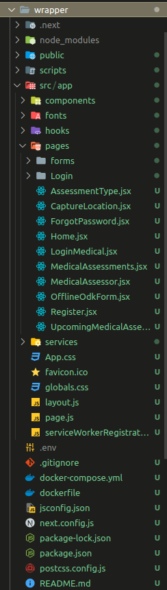

## Milestones
- I started migrating the pwa-poc repo to Next.js 13:
This milestone marks the beginning of the migration process. Next.js 13 is the target framework for the migration. It is an updated version of Next.js, a React framework for building web applications. The goal is to migrate the existing pwa-poc repository to Next.js 13, taking advantage of its features and improvements.

- Initially, I copied all the existing components and pages to the newly created Next.js project:
In this milestone, all the components and pages from the pwa-poc repository are copied to the newly created Next.js project. This step ensures that the existing functionality and user interface of the project are preserved during the migration process.

- Then I changed the routing of the project as Next.js 13 follows new routing, forming routes based on foldername/page.jsx:
Next.js 13 introduces a new routing approach, where routes are automatically generated based on the folder and file structure. In this milestone, the routing of the project is updated to align with the new routing system. This involves organizing the components and pages in the appropriate folder structure and ensuring that their filenames follow the required conventions.

Then I changed some imports, previously done by React, to calling the dependencies from Next.js:
Next.js provides its own set of dependencies and modules that should be used instead of the ones from the React ecosystem. In this milestone, the import statements in the codebase are modified to use the corresponding Next.js dependencies instead of the previously used React dependencies. This ensures compatibility and proper integration with Next.js features.

I fixed some minor bugs and successfully migrated the React.js project to Next.js 13:
During the migration process, it is common to encounter minor issues or bugs that need to be addressed. In this milestone, these issues are resolved, and any necessary bug fixes or adjustments are made.

## Screenshots / Videos 

## Contributions
- [Pull Request for the migrated Project](https://github.com/Rohan27s/pwa-poc/pull/1)

## Learnings

- I learnt the new routing technique which was done in the 13th Version of Next.js.