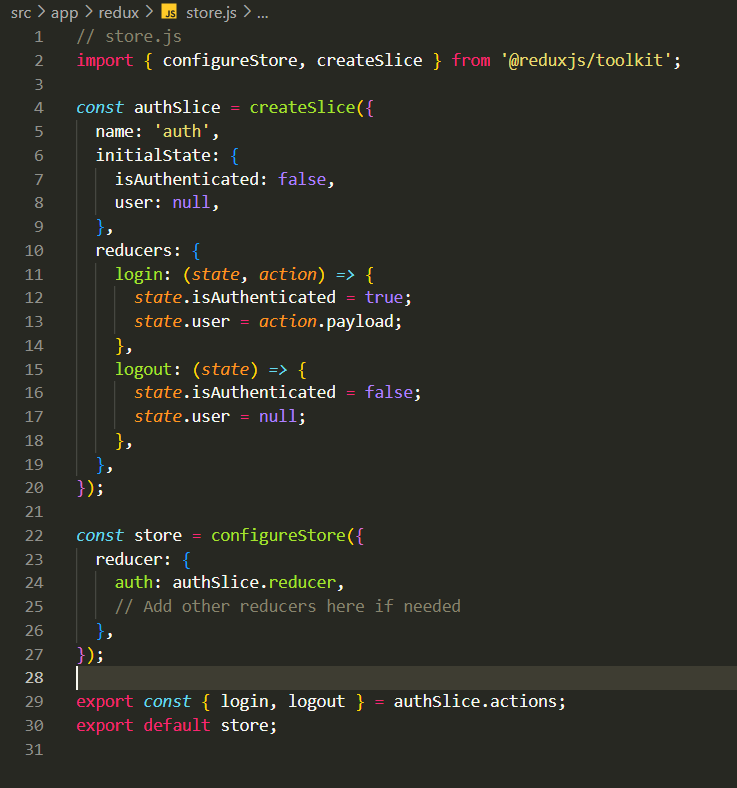
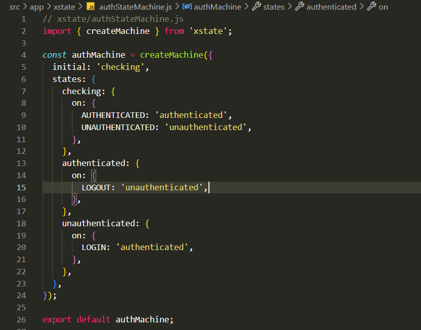

## Milestones
- Fixed bugs in Week 1 & 2 code:
During the initial weeks of development, I diligently conducted testing and code reviews to identify and address any issues in the application's codebase. I discovered several bugs that were affecting the application's functionality and stability. These bugs might have caused unexpected behavior, crashes, or incorrect data processing. To rectify these issues, I followed a systematic debugging process, tracing the root causes and implementing appropriate fixes. By resolving these bugs, I ensured that the application was running smoothly and providing a reliable experience to users.

- Integrated Redux for managing global state:
As the application started to grow in complexity, it became essential to have a structured and centralized approach to managing its state. Redux, a popular state management library for JavaScript applications, provided an excellent solution. I integrated Redux into the application to handle global state efficiently. Redux operates on a single immutable state tree, making it easier to manage and track changes across the entire application. With Redux, I could dispatch actions to modify the state and update various components that rely on this state. By adopting Redux, I enhanced the predictability of state changes, made debugging easier, and improved the overall maintainability of the codebase.

- Integrated Xstate to enhance Redux's global state handling:
While Redux was effective in managing the application's state, I sought to further optimize the handling of global state, especially in scenarios involving complex state transitions and asynchronous behaviors. This is where Xstate, a powerful state management library based on state machines, came into play. By integrating Xstate alongside Redux, I was able to create a more structured and organized approach to managing state transitions and side effects. Xstate allowed me to model the application's state as a finite state machine (FSM), with well-defined states and possible transitions. This clarity enabled me to have a deeper understanding of how the application should behave in different situations, making it easier to implement and test state changes.

Moreover, Xstate's support for hierarchical and parallel states provided greater flexibility in handling more intricate state interactions. For instance, in scenarios where multiple states needed to coexist and interact with each other, Xstate offered a clear and concise representation of the state hierarchy, simplifying the management of complex workflows.

By combining Redux and Xstate, I not only ensured a structured and centralized global state management system but also improved the application's resilience and adaptability. The integration of these two libraries allowed me to build a more scalable and maintainable codebase, making it easier to add new features, fix bugs, and accommodate future changes. Overall, this approach significantly contributed to a smoother and more efficient user experience while ensuring the application remained robust and stable under various conditions.

## Screenshots / Videos 

## Contributions

## Learnings

- During this week, I focused on learning how to use Xstate alongside Redux for managing our application's global state. Xstate provided a clear and organized way to represent state transitions and interactions, making it easier to understand and maintain the application's behavior. By combining Xstate with Redux, I achieved better state management, improved predictability of state changes, and enhanced debugging capabilities. The integration of these two libraries resulted in a more scalable and maintainable codebase, setting the foundation for the project's future growth. Overall, it was a rewarding learning experience that improved our application's overall stability and user experience.