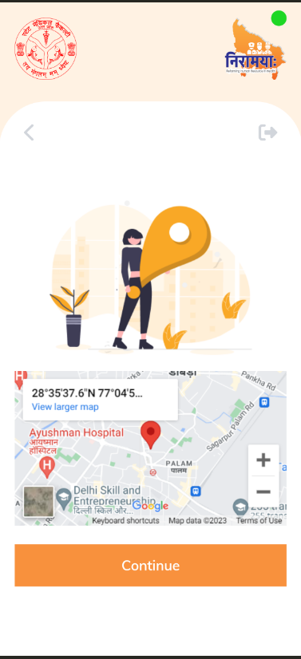
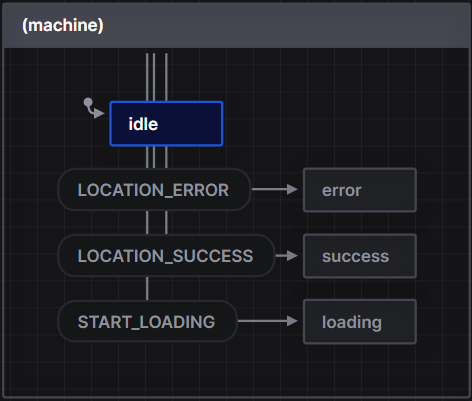
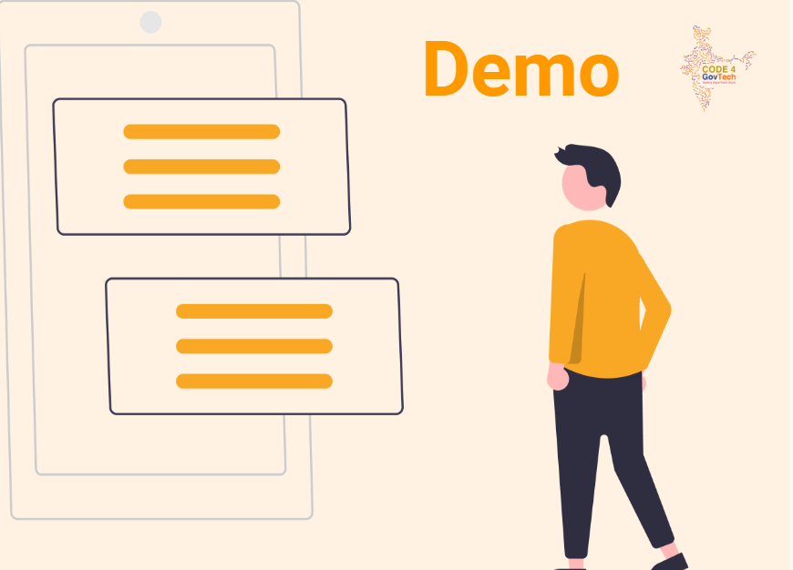

## Milestones
* Extended the XState logic for all the components and managed the State transitions:

   - Identified all the components in the application that require state management.
   - Implemented XState logic to handle the state transitions for each component.
   - Defined the possible states and events for each component.
   - Ensured smooth and correct transitions between states, handling edge cases effectively.
   - Created a well-organized and maintainable XState configuration for the entire application.

* Used XState for handling authentication, user location, and various states like idle, loading, success, and error:

   - Implemented XState to handle the authentication flow, considering different authentication states (logged in, logged out, etc.).
   - Utilized XState to manage user location updates, considering states like tracking location, location found, location not available, etc.
   - Implemented state management using XState for other asynchronous processes, such as API calls or data fetching, to handle states like idle, loading, success, and error gracefully.
   - I ensured that the UI reacts appropriately to each state, providing meaningful feedback and user interactions for a seamless experience.

## Screenshots / Videos 

## Contributions
- [Pull Request for Week 3 & 4](https://github.com/Rohan27s/pwa-poc/pull/2)
- [Demo Showcase PPT Link](https://docs.google.com/presentation/d/1dZMxHndXHUEhXtJAxxns28q1NwpPj7iM/edit?usp=sharing&ouid=112927222021605977484&rtpof=true&sd=true)

## Learnings

- I learnt hierarchical state management using XState and to organize states in a tree-like structure, handle concurrent processes efficiently, and make UI components more modular. XState's visualization tools were valuable for debugging. Overall, it's a powerful approach for building robust applications. Excited to use it in future projects!