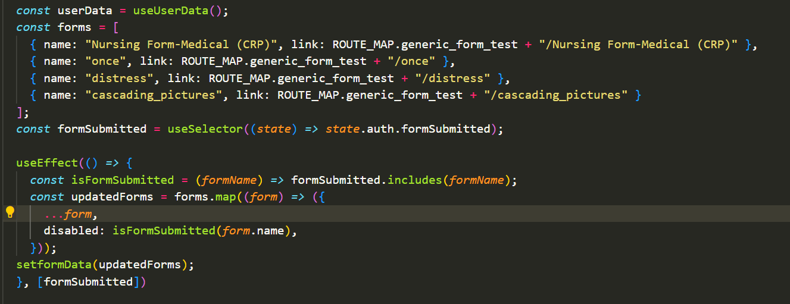
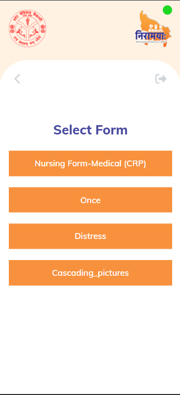
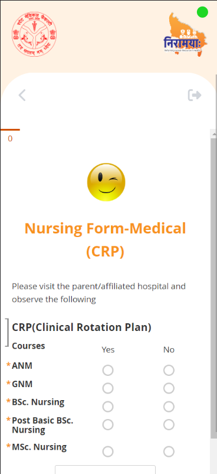

## Milestones

#### Milestone: Configuring Environment Variables for Enketo Forms Integration

- Completed the setup of environment variables necessary for integrating Enketo forms into the application. These variables include authentication credentials, API endpoints, and other configuration settings.

#### Milestone: Establishing Connections and Communication with Enketo Forms API and Form Manager Service

- Successfully established connections with both the Enketo Forms API and the Form Manager Service.  Tested communication by making initial API requests and receiving valid responses.

#### Milestone: Retrieving Form Data from Enketo Forms API

- Implemented the logic to fetch form data from the Enketo Forms API. Utilized appropriate API endpoints and parameters to retrieve form structures, questions, options, and other related data. Verified data retrieval by logging or displaying fetched information.

#### Milestone: Ensuring Proper Rendering of Forms within the Application

- Implemented the rendering of Enketo forms within the application's user interface. Ensured that form layouts, question types, and interactions are accurately displayed within the application, closely resembling the Enketo interface.

## Screenshots / Videos 
#### Code for initialising types of forms 

#### Available Forms UI 

#### Rendered Forms UI 

## Contributions

## Learnings
- Acquired a solid understanding of Enketo form integration, including its API, authentication methods, and interaction flow between the application and Enketo services.

- Successfully implemented dynamic routes in the application using the innovative Next.js v13 approach, defining a folder name (slug) for generating dynamic routes.