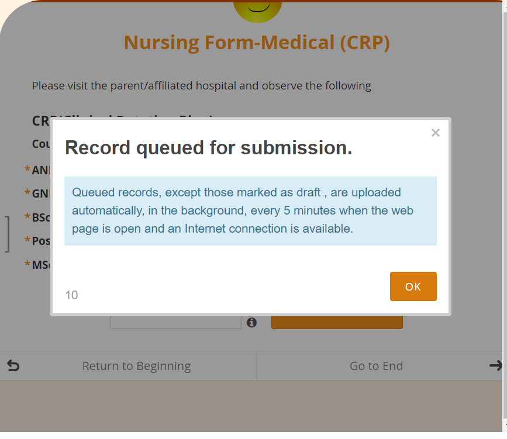
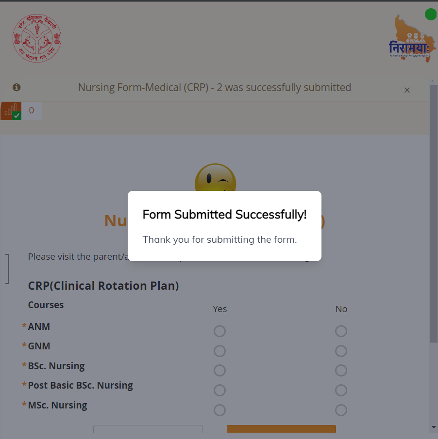
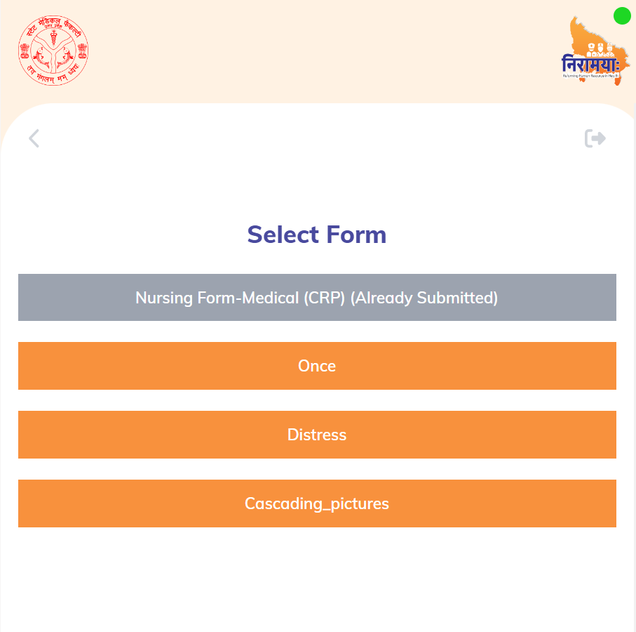
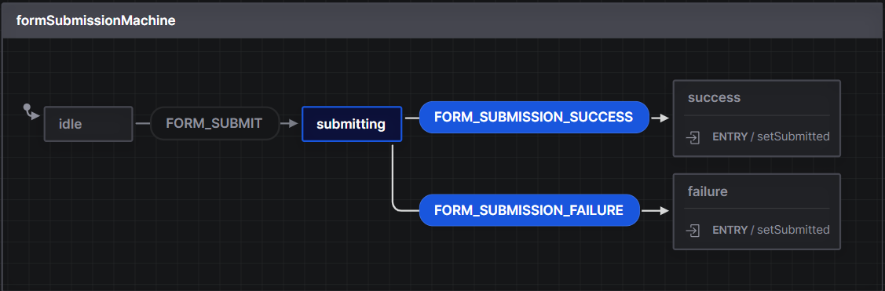

## Milestones
- I've not only completed the form submission process for Enketo forms but have also conducted extensive testing to validate their seamless functionality and performance.

- In addition, I've taken the initiative to integrate Redux into the system, a decision that has proven to be invaluable. With Redux in place, the form submission process has been elevated to a new level of efficiency. The integration allows the form's submission button to intelligently disable itself after the initial submission. This feature prevents users from inadvertently submitting the same form multiple times, safeguarding data integrity and eliminating any potential confusion in the process.

- This enhancement not only streamlines the user experience but also adds a layer of data accuracy to the entire form submission mechanism. By seamlessly integrating Redux, I've ensured that users can confidently interact with the Enketo forms, knowing that their submissions are precise, and they won't encounter any complications arising from multiple submissions. This accomplishment underscores my commitment to delivering a polished and user-friendly system that optimizes the form submission experience while maintaining the highest standards of data quality.

## Screenshots / Videos 
#### Form Submission UI 

#### Form Submission Done UI  

#### Already Submitted Form UI

#### Form Submission XState Machine

## Contributions
- [Pull Request for Week 5 & 6](https://github.com/Rohan27s/pwa-poc/pull/3)

## Learnings

### Enketo Form Responses
The completion of the Enketo form submission process, coupled with rigorous testing, has provided me with an in-depth understanding of the intricacies involved in handling Enketo form submissions.

Throughout this process, I've gained valuable insights into how Enketo forms capture user inputs, process them, and subsequently transmit the data to the designated server. This has deepened my knowledge of the underlying mechanisms that govern the seamless exchange of information between users and Enketo forms.

Additionally, delving into the technical aspects, I've learned about the specific protocols and procedures that Enketo employs to communicate with servers. This encompasses data packaging, transmission methods, and the server's reception and handling of form responses. This knowledge has underscored the importance of accurate data transfer and reinforced the significance of robust server-client interactions within the Enketo form ecosystem.

In essence, this experience has not only broadened my understanding of Enketo form submission but has also equipped me with the skills to design and optimize effective data capture processes within the Enketo framework.