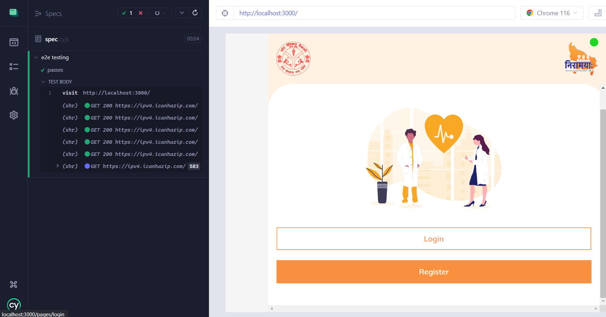
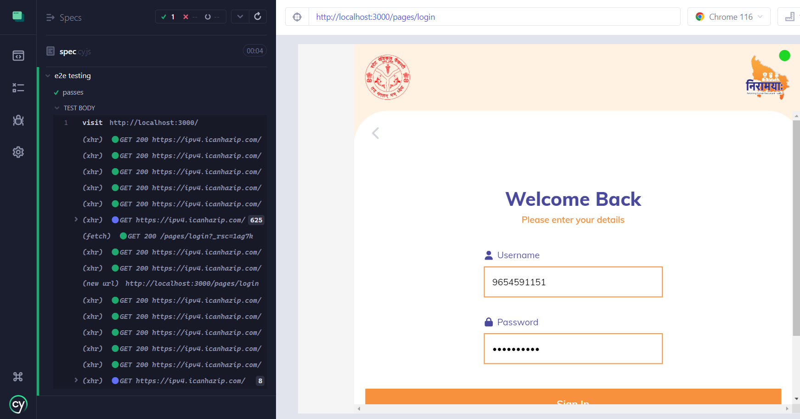
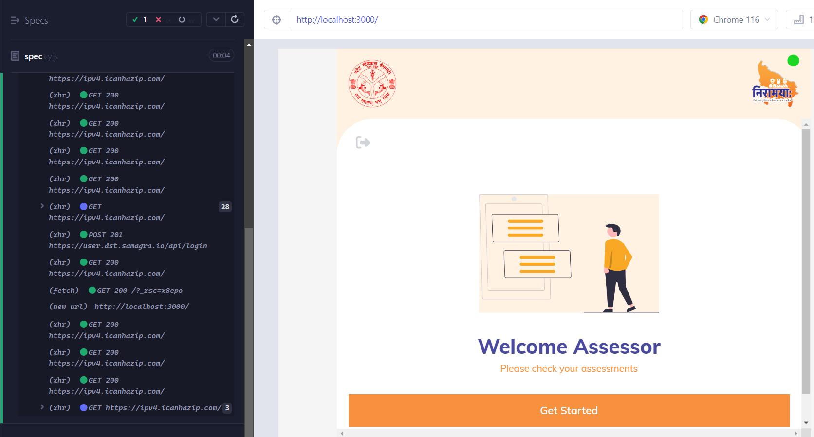
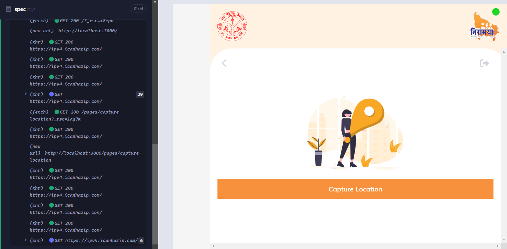
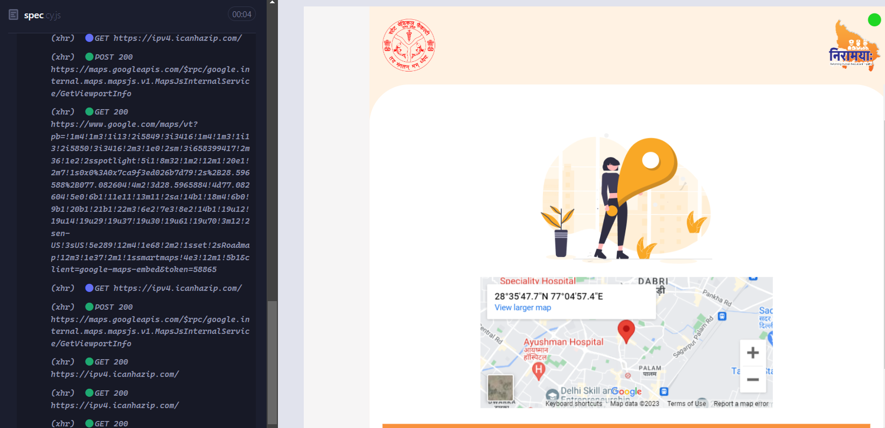
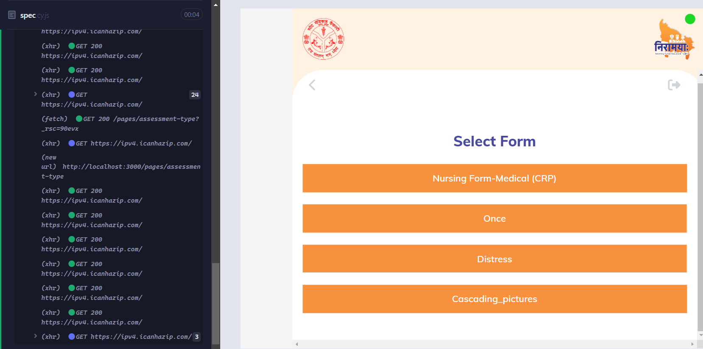
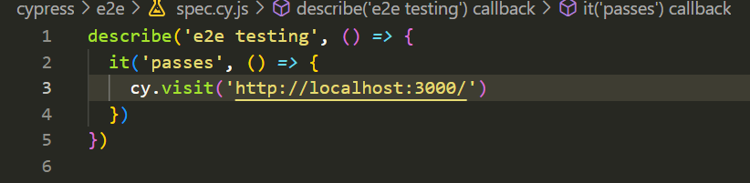
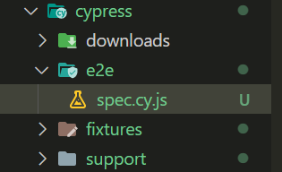

## Milestones
Milestone: End-to-End Testing with Cypress for Workflow Project

In this milestone, I have successfully completed the implementation of end-to-end (e2e) testing using Cypress for the Workflow project. The purpose of this milestone was to ensure that the project's components, interactions, and user flows function as expected, covering various scenarios and ensuring a smooth user experience.

Key Achievements:

1. **Cypress Integration:** Integrated the Cypress testing framework into the Workflow project to facilitate end-to-end testing.

2. **Test Setup:** Created a dedicated directory for e2e tests and organized them into separate test files based on component functionality.

3. **Component Testing:** Designed and executed comprehensive test cases to verify the correctness of various project components, including layout, forms, user interactions, and more.

4. **User Flows:** Simulated real user interactions with the application, including form submissions, navigation, and interaction with various UI elements.

5. **Viewport Simulation:** Utilized Cypress's viewport settings to mimic different device sizes and test responsiveness for a range of screen resolutions, including simulating the viewport size of an iPhone 12.

6. **Assertions:** Implemented meaningful assertions to validate the correctness of the rendered components, expected content, and navigation outcomes.

7. **Scenarios Coverage:** Ensured coverage of common and edge cases to identify and address potential bugs, errors, or unexpected behavior in the application.

8. **Debugging and Refinement:** Addressed any failed tests, debugged issues, and iteratively refined the test cases to achieve reliable and accurate testing results.

9. **Documentation:** Documented the test scenarios, setup instructions, and testing results to aid future development and testing efforts.

Conclusion:

The successful completion of this milestone has provided a robust testing foundation for the Workflow project. By incorporating end-to-end testing with Cypress, we have improved the project's quality, identified potential issues early in the development process, and contributed to a more seamless user experience. This milestone signifies a significant step towards ensuring the overall stability, functionality, and reliability of the Workflow application.

## Screenshots / Videos 
#### HomeScreen UI

#### Login UI 

#### Welcome Page UI 

#### Location:Before UI 

#### Location:After UI 

#### Form Buttons UI 

#### Cypress's Code 

#### Cypress's Folder Structure

## Contributions

- [Pull Request for Week 7](https://github.com/Rohan27s/pwa-poc/pull/4)

## Learnings

#### Learnings from Implementing End-to-End Testing with Cypress for Workflow Project

Throughout the process of implementing end-to-end (e2e) testing using Cypress for the Workflow project, I gained valuable insights and experiences that have contributed to my understanding of testing practices and the development lifecycle. Here are some key learnings from this testing endeavor:

**Comprehensive Test Coverage:** I learned the importance of thorough test coverage. By testing various components, interactions, and user flows, I was able to uncover potential issues that might not have been evident during manual testing.

**Automated vs. Manual Testing:** The implementation of e2e testing with Cypress highlighted the efficiency and reliability of automated testing. It allowed me to repetitively and consistently test scenarios, freeing up time for more creative and complex tasks.

**Simulating User Interactions:** I discovered how Cypress allows us to simulate real user interactions, such as filling out forms, clicking buttons, and navigating through the application. This provided insights into the user experience and identified areas for improvement.

**Debugging and Troubleshooting:** I learned to effectively troubleshoot and debug test failures. The error messages and logs provided by Cypress were instrumental in identifying the root causes of issues and addressing them promptly.

**Viewport Simulation:** Cypress's viewport simulation taught me the significance of responsive design. Simulating different device sizes helped me identify UI inconsistencies and ensure a seamless experience across various screen resolutions.

**Enhancing Code Quality:** Through testing, I gained a deeper understanding of how code quality impacts test outcomes. Well-structured and maintainable code not only aids testing but also contributes to a smoother development process.

**Early Issue Detection:** Implementing testing early in the development process allowed me to identify and address issues before they escalated. This proactive approach reduced the likelihood of encountering critical bugs in later stages.

**Integration into Development Workflow:** I learned how to integrate testing seamlessly into the development workflow. Writing tests as features are developed and addressing issues in parallel improved the overall development efficiency.

**Continuous Improvement:** Testing is an ongoing process. The insights gained from test results can guide iterative improvements to the application's functionality, user experience, and reliability.

In conclusion, the journey of implementing e2e testing using Cypress for the Workflow project was an educational experience that enriched my understanding of software testing, quality assurance, and the importance of automation in the development lifecycle. These newfound learnings will undoubtedly contribute to my future development projects and help create more robust and user-friendly applications.