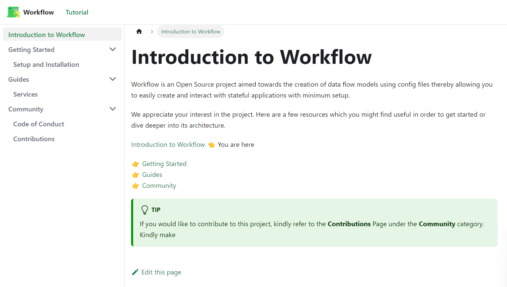
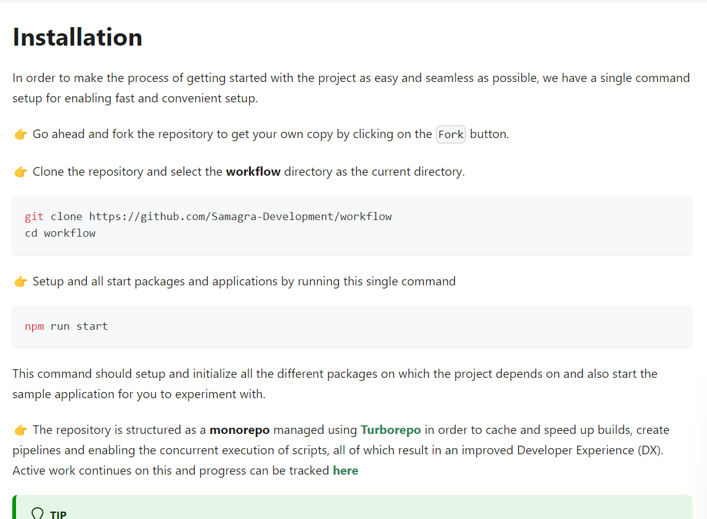
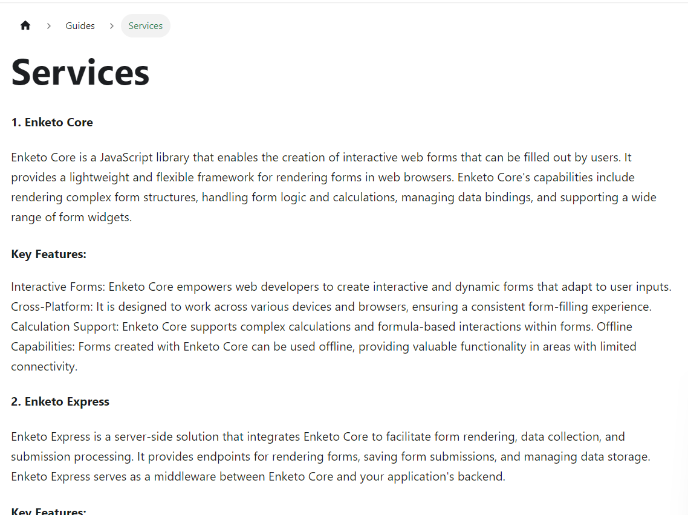

## Milestones
 I've successfully completed and updated the project's documentation using Docusaurus. This step is a crucial one in enhancing user experience and providing clear insights into our project's features and functionalities.

Here are the key highlights of this achievement:

**User-Centric Approach:** With the migration to Docusaurus, I've structured the documentation to be user-centric, making it easy for all stakeholders to access the information they need. The organized format ensures that users can quickly find details about the project's setup, components, and usage guidelines.

**Service Descriptions:** I've taken the opportunity to comprehensively describe the core services driving our project – Enketo Core, Enketo Express, Centro, and Form Manager. By offering detailed explanations, I aim to provide a clear understanding of how these services contribute to the overall workflow system.

**Updated Installation Steps:** Considering the migration to Next.js 13, I've updated the installation instructions to align with the latest changes in the project's architecture. This ensures that new users can seamlessly onboard and start utilizing the system.

This milestone reflects my dedication to delivering a well-documented, user-friendly, and efficient workflow solution. Completing the documentation is a significant step towards empowering users to make the most of our system's capabilities.

## Screenshots / Videos 
#### Intro

#### Installation

#### Services

## Contributions

- [Repository link for docusaurus](https://github.com/Rohan27s/workflow-doc)
## Learnings

#### In-Depth Understanding:
 Writing the documentation allowed me to dive deep into the project's features and services. This firsthand experience made me realize how clear instructions can make a world of difference.