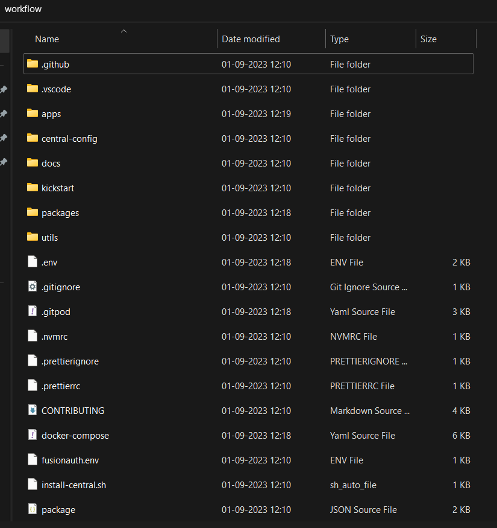
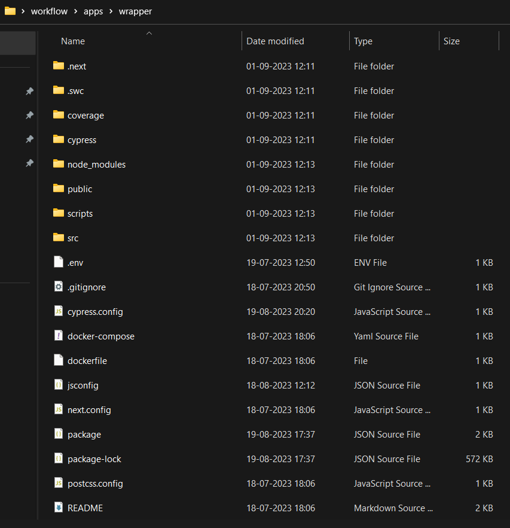

## Milestones
- **Code Integration:** I merged our final Next.js project code into our main workflow, combining all its features and functionalities seamlessly.

- **Version Control:** I've maintained version control by pushing the integrated code to our version control system, making it accessible to all team members for collaboration.

- **Dockerization:** I've configured Docker containers to run our project consistently, simplifying deployment and execution.

- **Unit Testing with Cypress:** I've performed thorough unit testing using Cypress to confirm that our integrated project functions correctly, ensuring a top-notch user experience.

- **Documentation:** I've updated our documentation to reflect these changes, making it easier for team members to understand and maintain the project.

## Screenshots / Videos 
#### Workflow Root Folder 

#### Integrated project in workflow 

## Contributions

- [Final Pull Request](https://github.com/Samagra-Development/workflow/pull/78)
## Learnings

- **Seamless Integration:** Successfully integrating a complex project into the main workflow requires careful planning and attention to detail.

- **Version Control is Crucial:** Maintaining version control throughout the integration process is essential to ensure that team members can collaborate effectively and access the latest updates.

- **Dockerization Simplifies Deployment:** Implementing Docker changes can significantly simplify the deployment and execution of a project by creating a consistent and reproducible environment.

- **Quality Assurance is Non-Negotiable:** Thorough unit testing using tools like Cypress is vital for validating the functionality and quality of the integrated project.

- **Documentation Matters:** Clear and up-to-date documentation is crucial for helping team members understand and maintain the project, especially in a collaborative environment.

- **Collaboration is Key:** Effective collaboration with mentor is essential for a successful integration, as it ensures that the final product aligns with expectations and requirements.

- **Planning and Communication:** Detailed planning and effective communication are critical throughout the integration process to avoid misunderstandings and streamline the workflow.

- **Continuous Improvement:** Integration projects provide valuable opportunities for learning and improvement. Feedback and insights gained during integration can be used to enhance future projects.

- **Deployment Readiness:** Preparing the integrated project for production deployment involves optimizing configurations for performance and security, and it's a crucial step in the process.

- **Achievement and Pride:** Successfully completing a significant milestone in a project, such as this integration, is a source of pride and motivation for further progress.