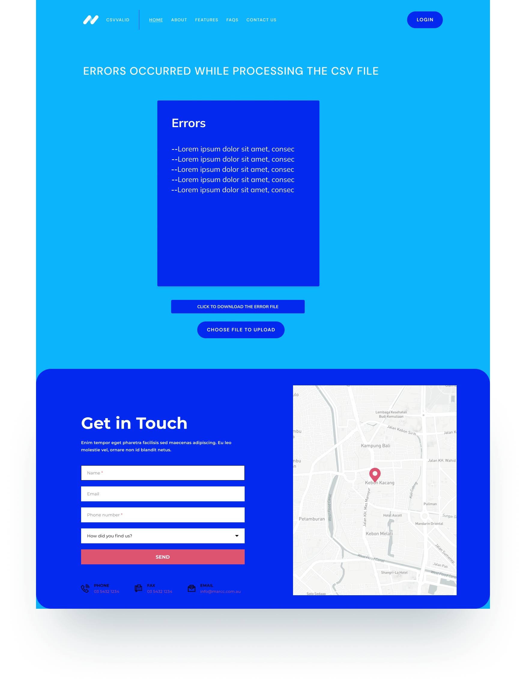

## Milestones

- [x] Had the opportunity to engage with my mentor and gain a deeper understanding of the project.
- [x] Acquired proficiency in utilizing Figma for design work.
- [x] Created user-friendly and visually appealing UI/UX for project, including Home, Validation, Custom Validation, Admin, and Error pages.
- [x] Reviewed other validation projects.
- [x] Planned to integrate AI and ML in the project, either in the schedule or for future development.

## Screenshots / Videos

## Contributions

- https://www.figma.com/proto/mS8wxQtI3DaTrnWAqFQ2YU/File-Validator-for-Cqube?type=design&node-id=2-413&t=B8aKVBEcTtmAOrcl-0&scaling=min-zoom&page-id=0%3A1&starting-point-node-id=2%3A413

## Learnings

- Figma offers the advantage of efficient and collaborative design work for projects.
- I gained insights into incorporating additional features and identified areas of improvement from other projects.
- Got to know how AI and ML enhance the accuracy and efficiency of CSV file validation in the project.
